# Sparse NUTS for TMB models

``` r
library(SparseNUTS)
```

## Differences between TMB and RTMB

`SparseNUTS` implements the sparse no-u-turn sampler (SNUTS) as
introduced and detailed in (C. C. Monnahan et al. in prep). This only
works for TMB models because Stan currently has no way to pass and use a
sparse metric. Both TMB and RTMB models can be used without user
specification, including parallel chains. The `sample_snuts` function
will detect which is used internally and adjust accordingly. If the user
wants to use models from both packages in the same session then one
needs to be unloaded, e.g.,
`if('TMB' %in% .packages()) detach(package:TMB)`, before the other
package is loaded.

If the RTMB model uses external functions or data sets then they must be
passed through via a list in the `globals` argument so they are
available to rebuild the ‘obj’ in the parallel R sessions. Optionally,
the `model_name` can be specified in the call, otherwise your model will
be labeled “RTMB” in the output. TMB models do not require a globals
input and the model name is pulled from the DLL name, but can be
overridden if desired.

## Comparison to tmbstan

The related package ‘tmbstan’ (C. C. Monnahan and Kristensen 2018) also
allows users to link TMB models to the Stan algorithms. ‘tmbstan’ links
through the package ‘rstan’, while ‘SparseNUTS’ modifies the objective
and gradient functions and then passes those to ‘cmdstan’ through the
‘StanEstimators’ R package interface. For models without large
correlations or scale differences, `tmbstan` is likely to be faster than
‘SparseNUTS’ due to lower overhead and may be a better option.
Eventually, Stan may add SNUTS functionality and an interface to
‘tmbstan’ developed, and in that case `tmbstan` may be a better long
term option. For TMB users now, SNUTS via `SparseNUTS` is likely to be
the best overall package for Bayesian inference.

## SNUTS for TMB models from existing packages (sdmTMB, glmmTMB, etc.)

`SparseNUTS` works for custom TMB and RTMB models developed locally, but
also for those that come in packages. Most packages will return the TMB
‘obj’ which can then be passed into `sample_snuts`.

For instance the `glmmTMB` package can be run like this:

``` r
library(glmmTMB)
data(Salamanders)
obj <- glmmTMB(count~spp * mined + (1|site), Salamanders, family="nbinom2")$obj
fit <- sample_snuts(obj)
```

## Basic usage

The recommended usage for TMB users is to let the `sample_snuts`
function automatically detect the metric to use and the length of warmup
period, especially for pilot runs during model development.

I demonstrate basic usage using a very simple RTMB version of the eight
schools model that has been examined extensively in the Bayesian
literature. The first step is to build the TMB object ‘obj’ that
incorporates priors and Jacobians for parameter transformations. Note
that the R function returns the negative un-normalized log-posterior
density.

``` r
library(RTMB)
dat <- list(y=c(28,  8, -3,  7, -1,  1, 18, 12),
            sigma=c(15, 10, 16, 11,  9, 11, 10, 18))
pars <- list(mu=0, logtau=0, eta=rep(1,8))
f <- function(pars){
  getAll(dat, pars)
  theta <- mu + exp(logtau) * eta;
  lp <- sum(dnorm(eta, 0,1, log=TRUE))+ # prior
    sum(dnorm(y,theta,sigma,log=TRUE))+ #likelihood
    logtau                          # jacobian
  REPORT(theta)
  return(-lp)
}
obj <- MakeADFun(func=f, parameters=pars,
                 random="eta", silent=TRUE)
```

### Posterior sampling with SNUTS

The most common task is to draw samples from the posterior density
defined by this model. This is done with the `sample_snuts` function as
follows:

``` r
fit <- sample_snuts(obj, refresh=0, seed=1,
                    model_name = 'schools',
                    cores=1, chains=1,
                    globals=list(dat=dat))
#> Optimizing...
#> Getting Q...
#> Inverting Q...
#> Q is 62.22% zeroes, with condition factor=56 (min=0.044, max=2.5)
#> Rebuilding RTMB obj without random effects...
#> diag metric selected b/c of low correlations (max=0.2927)
#> log-posterior at inits=-34.661; at conditional mode=-34.661
#> Starting MCMC sampling...
#> 
#> 
#> Gradient evaluation took 9.1e-05 seconds
#> 1000 transitions using 10 leapfrog steps per transition would take 0.91 seconds.
#> Adjust your expectations accordingly!
#> 
#> 
#> 
#>  Elapsed Time: 0.111 seconds (Warm-up)
#>                0.609 seconds (Sampling)
#>                0.72 seconds (Total)
#> 
#> 
#> 
#> Model 'schools' has 10 pars, and was fit using NUTS with a 'diag' metric
#> 1 chain(s) of 1150 total iterations (150 warmup) were used
#> Average run time per chain was 0.72 seconds 
#> Minimum ESS=266 (26.6%), and maximum Rhat=1.003
#> There were 0 divergences after warmup
```

The returned object `fit` (an object of ‘adfit’ S3 class) contains the
posterior samples and other relevant information for a Bayesian
analysis.

Here a ‘diag’ (diagonal) metric is selected and a very short warmup
period of 150 iterations is used, with mass matrix adaptation in Stan
disabled. See below for more details on mass matrix adaptation within
Stan.

Notice that no optimization was done before calling `sample_snuts`. When
the model has already been optimized, you can skip that by setting
`skip_optimization=TRUE`, and even pass in $Q$ and $\Sigma = Q^{- 1}$
via arguments `Q` and `Qinv` to bypass this step and save some run time.
This may also be required if the model optimization routine internal to
`sample_snuts` is insufficient. In that case, the user should optimize
prior to SNUTS sampling. The returned fitted object contains a slot
called `mle` (for maximum likelihood estimates) which has the
conditional mode (‘est’), the marginal standard errors ‘se’, a joint
correlation matrix (‘cor’), and the sparse precision matrix $Q$.

``` r
str(fit$mle)
#> List of 5
#>  $ nopar: int 10
#>  $ est  : Named num [1:10] 7.92441 1.8414 0.47811 0.00341 -0.2329 ...
#>   ..- attr(*, "names")= chr [1:10] "mu" "logtau" "eta[1]" "eta[2]" ...
#>  $ se   : Named num [1:10] 4.725 0.732 0.959 0.872 0.945 ...
#>   ..- attr(*, "names")= chr [1:10] "mu" "logtau" "eta[1]" "eta[2]" ...
#>  $ cor  : num [1:10, 1:10] 1 0.0558 -0.1031 -0.2443 -0.114 ...
#>   ..- attr(*, "dimnames")=List of 2
#>   .. ..$ : chr [1:10] "mu" "logtau" "eta[1]" "eta[2]" ...
#>   .. ..$ : chr [1:10] "mu" "logtau" "eta[1]" "eta[2]" ...
#>  $ Q    :Formal class 'dsCMatrix' [package "Matrix"] with 7 slots
#>   .. ..@ i       : int [1:27] 0 1 2 3 4 5 6 7 8 9 ...
#>   .. ..@ p       : int [1:11] 0 10 19 20 21 22 23 24 25 26 ...
#>   .. ..@ Dim     : int [1:2] 10 10
#>   .. ..@ Dimnames:List of 2
#>   .. .. ..$ : chr [1:10] "mu" "logtau" "eta[1]" "eta[2]" ...
#>   .. .. ..$ : chr [1:10] "mu" "logtau" "eta[1]" "eta[2]" ...
#>   .. ..@ x       : num [1:27] 0.0603 -0.0144 0.028 0.0631 0.0246 ...
#>   .. ..@ uplo    : chr "L"
#>   .. ..@ factors :List of 1
#>   .. .. ..$ SPdCholesky:Formal class 'dCHMsuper' [package "Matrix"] with 10 slots
#>   .. .. .. .. ..@ x       : num [1:100] 1.06 0 0 0 0 ...
#>   .. .. .. .. ..@ super   : int [1:2] 0 10
#>   .. .. .. .. ..@ pi      : int [1:2] 0 10
#>   .. .. .. .. ..@ px      : int [1:2] 0 100
#>   .. .. .. .. ..@ s       : int [1:10] 0 1 2 3 4 5 6 7 8 9
#>   .. .. .. .. ..@ type    : int [1:6] 2 1 1 1 1 1
#>   .. .. .. .. ..@ colcount: int [1:10] 3 3 3 3 3 3 4 3 2 1
#>   .. .. .. .. ..@ perm    : int [1:10] 9 8 7 6 5 4 0 2 3 1
#>   .. .. .. .. ..@ Dim     : int [1:2] 10 10
#>   .. .. .. .. ..@ Dimnames:List of 2
#>   .. .. .. .. .. ..$ : chr [1:10] "mu" "logtau" "eta[1]" "eta[2]" ...
#>   .. .. .. .. .. ..$ : chr [1:10] "mu" "logtau" "eta[1]" "eta[2]" ...
```

### Diagnostics

The common MCMC diagnostics potential scale reduction (Rhat) and minimum
ESS, as well as the NUTS divergences (see [diagnostics
section](https://mc-stan.org/docs/reference-manual/analysis.html) of the
rstan manual), are printed to console by default or can be accessed in
more depth via the `monitor` slot:

``` r
print(fit)
#> Model 'schools' has 10 pars, and was fit using NUTS with a 'diag' metric
#> 1 chain(s) of 1150 total iterations (150 warmup) were used
#> Average run time per chain was 0.72 seconds 
#> Minimum ESS=266 (26.6%), and maximum Rhat=1.003
#> There were 0 divergences after warmup

fit$monitor |> str()
#> 'data.frame':    11 obs. of  23 variables:
#>  $ variable  : chr  "mu" "logtau" "eta[1]" "eta[2]" ...
#>  $ mean      : num  7.8963 1.3284 0.3436 0.0114 -0.1834 ...
#>  $ se_mean   : num  0.1765 0.0673 0.0269 0.0249 0.0264 ...
#>  $ sd        : num  4.767 1.161 0.972 0.834 0.863 ...
#>  $ 2.5%      : num  -1.12 -1.5 -1.74 -1.63 -1.86 ...
#>  $ 25%       : num  4.805 0.654 -0.352 -0.511 -0.754 ...
#>  $ 50%       : num  7.5789 1.6113 0.399 0.0223 -0.1674 ...
#>  $ 75%       : num  10.941 2.181 1.017 0.532 0.381 ...
#>  $ 97.5%     : num  17.67 2.98 2.16 1.66 1.52 ...
#>  $ n_eff     : num  745 309 1355 1163 1063 ...
#>  $ Rhat      : num  1 1.001 0.999 1 1 ...
#>  $ valid     : num  1 1 1 1 1 1 1 1 1 1 ...
#>  $ Q5        : num  0.246 -1.01 -1.286 -1.344 -1.569 ...
#>  $ Q50       : num  7.5789 1.6113 0.399 0.0223 -0.1674 ...
#>  $ Q95       : num  15.75 2.82 1.85 1.36 1.26 ...
#>  $ MCSE_Q2.5 : num  0.5872 0.1836 0.1165 0.0942 0.05 ...
#>  $ MCSE_Q25  : num  0.2543 0.108 0.0474 0.0308 0.0362 ...
#>  $ MCSE_Q50  : num  0.2329 0.056 0.032 0.0282 0.0347 ...
#>  $ MCSE_Q75  : num  0.3126 0.0405 0.0391 0.0354 0.0329 ...
#>  $ MCSE_Q97.5: num  0.4675 0.0674 0.1179 0.0931 0.0357 ...
#>  $ MCSE_SD   : num  0.1332 0.0476 0.0299 0.0264 0.0242 ...
#>  $ Bulk_ESS  : num  745 309 1355 1163 1063 ...
#>  $ Tail_ESS  : num  534 502 692 704 603 568 847 660 768 671 ...
```

A specialized `pairs` plotting function is available (formally called
`pairs_admb`) to examine pair-wise behavior of the posteriors. This can
be useful to help diagnose particularly slow mixing parameters. This
function also displays the conditional mode (point) and 95% bivariate
confidence region (ellipses) as calculated from the approximate
covariance matrix $\Sigma = Q^{- 1}$. The parameters to show can be
specified either vie a character vector like
`pars=c('mu', 'logtau', 'eta[1]')` or an integer vector like `pars=1:3`,
and when using the latter the parameters can be ordered by slowest
mixing (‘slow’), fastest mixing (‘fast’) or by the largest discrepancies
in the approximate marginal variance from $Q$ and the posterior samples
(‘mismatch’). NUTS divergences are shown as green points. See help and
further information at `?pairs.adfit`.

``` r
pairs(fit, order='slow')
```

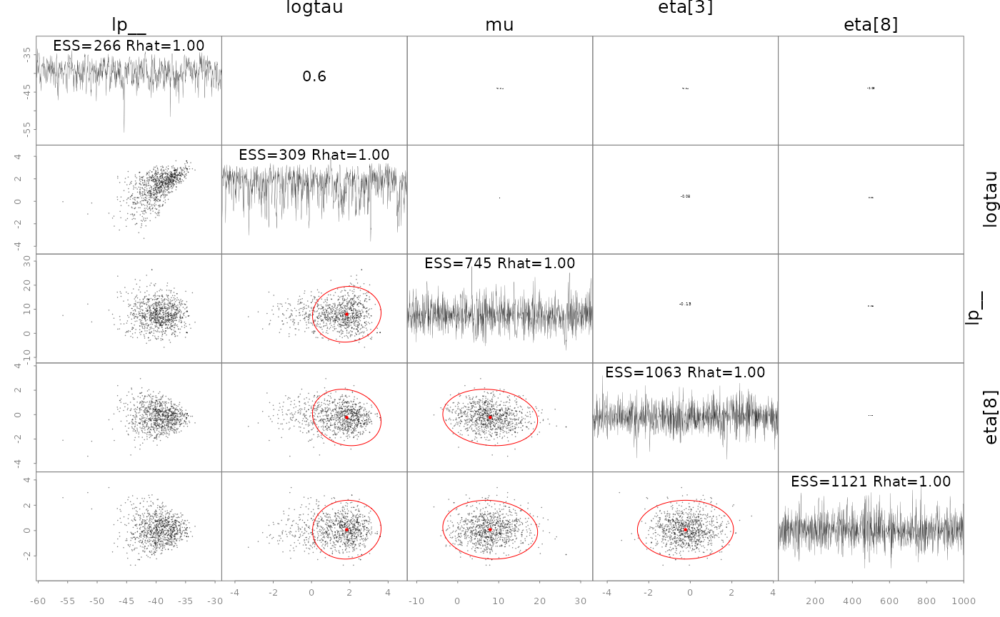

In some cases it is useful to diagnose the NUTS behavior by examining
the “sampler parameters”, which contain information about the individual
NUTS trajectories.

``` r
extract_sampler_params(fit) |> str()
#> 'data.frame':    850 obs. of  8 variables:
#>  $ chain        : num  1 1 1 1 1 1 1 1 1 1 ...
#>  $ iteration    : num  151 152 153 154 155 156 157 158 159 160 ...
#>  $ accept_stat__: num  0.901 0.762 0.546 0.896 0.945 ...
#>  $ stepsize__   : num  0.492 0.492 0.492 0.492 0.492 ...
#>  $ treedepth__  : num  3 3 4 3 3 3 3 2 3 3 ...
#>  $ n_leapfrog__ : num  7 7 15 7 7 7 7 3 7 7 ...
#>  $ divergent__  : num  0 0 0 0 0 0 0 0 0 0 ...
#>  $ energy__     : num  46.7 44.8 43.4 44.3 43.5 ...
## or plot them directly
plot_sampler_params(fit)
```

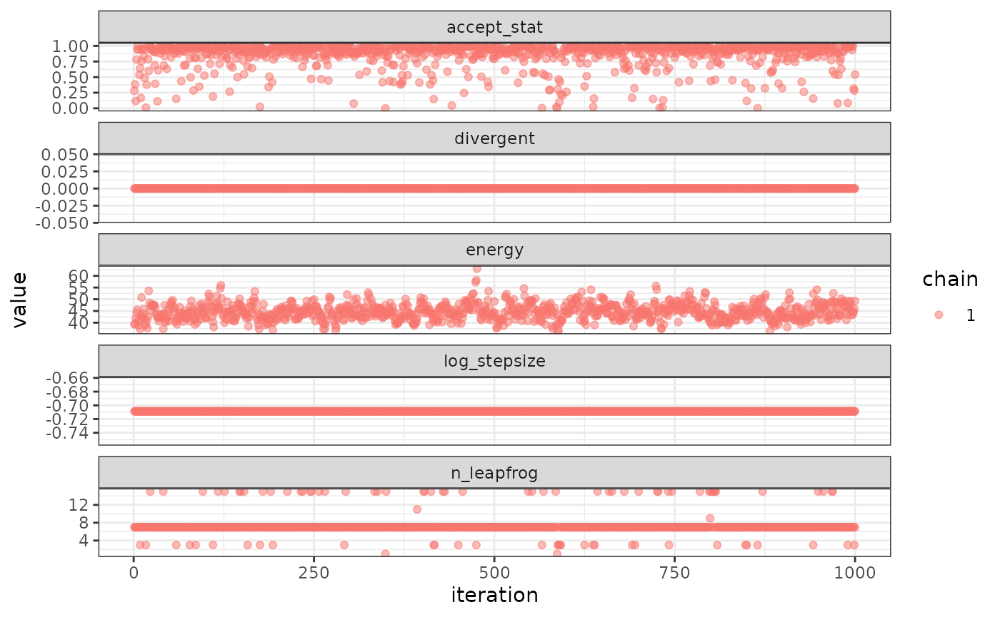

The ShinyStan tool is also available and provides a convenient,
interactive way to check diagnostics via the function
[`launch_shinytmb()`](https://cole-monnahan-noaa.github.io/SparseNUTS/reference/launch_shinytmb.md),
but also explore estimates and other important quantities. This is a
valuable tool for a workflow with ‘SparseNUTS’.

### Bayesian inference

After checking for signs of non-convergence the results can be used for
inference. Posterior samples for parameters can be extracted and
examined in R by casting the fitted object to an R data.frame. These
posterior samples can then be put back into the TMB object
`obj$report()` function to extract any desired “generated quantity” in
Stan terminology. Below is a demonstration of how to do this for the
quantity theta (a vector of length 8).

``` r
post <- as.data.frame(fit)
post |> str()
#> 'data.frame':    1000 obs. of  10 variables:
#>  $ mu    : num  12.01 9.87 4.4 10.34 4.88 ...
#>  $ logtau: num  3.328 3.605 -1.271 -0.259 2.178 ...
#>  $ eta[1]: num  1.026 1.319 -0.646 -2.113 -0.642 ...
#>  $ eta[2]: num  0.513 -0.215 0.132 0.175 0.961 ...
#>  $ eta[3]: num  0.04341 -0.44468 -0.01319 -0.30872 -0.00504 ...
#>  $ eta[4]: num  -0.0476 -0.3879 -0.2872 -1.1967 -0.4708 ...
#>  $ eta[5]: num  -0.224 -0.444 -0.3 -0.39 -1.31 ...
#>  $ eta[6]: num  -0.2575 -0.511 -0.5113 -0.7201 0.0883 ...
#>  $ eta[7]: num  0.2236 -0.0579 0.8496 0.0664 1.136 ...
#>  $ eta[8]: num  -0.216 0.422 -0.479 -0.726 -1.365 ...
## now get a generated quantity, here theta which is a vector of
## length 8 so becomes a matrix of posterior samples
theta <- apply(post,1, \(x) obj$report(x)$theta) |> t()
theta |> str()
#>  num [1:1000, 1:8] 40.606 58.386 4.221 8.714 -0.787 ...
```

Likewise, marginal distributions can be explored visually and compared
to the approximate estimate from the conditional mode and $\Sigma$ (red
lines):

``` r
plot_marginals(fit)
```

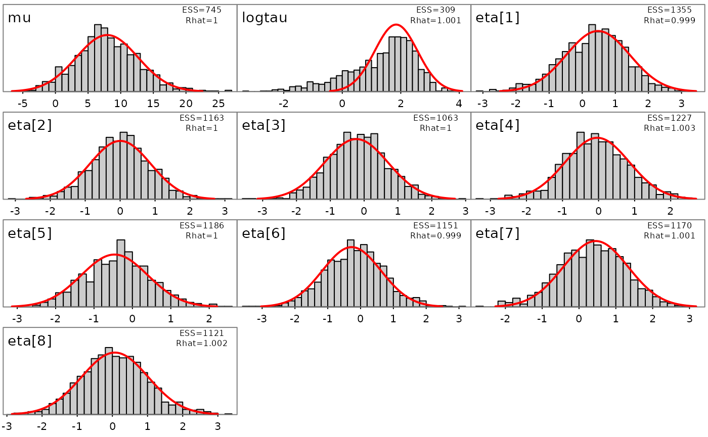

## A more complicated example

To demonstrate more than the basic usage I will use a more complicated
model. I modified the ChickWeight random slopes and intercepts example
from the RTMB introduction. Modifications include: switching SD
parameters to log space and adding a Jacobian, adding broad priors for
these SDs, and adding a ‘loglik’ vector for PSIS-LOO (below).

``` r
 
parameters <- list(
  mua=0,          ## Mean slope
  logsda=0,          ## Std of slopes
  mub=0,          ## Mean intercept
  logsdb=0,          ## Std of intercepts
  logsdeps=1,        ## Residual Std
  a=rep(0, 50),   ## Random slope by chick
  b=rep(0, 50)    ## Random intercept by chick
)

f <- function(parms) {
  require(RTMB) # for tmbstan
  getAll(ChickWeight, parms, warn=FALSE)
  sda <- exp(logsda)
  sdb <- exp(logsdb)
  sdeps <- exp(logsdeps)
  ## Optional (enables extra RTMB features)
  weight <- OBS(weight)
  predWeight <- a[Chick] * Time + b[Chick]
  loglik <- dnorm(weight, predWeight, sd=sdeps, log=TRUE)
  
  # calculate the target density
  lp <-   sum(loglik)+ # likelihood
    # random effect vectors
    sum(dnorm(a, mean=mua, sd=sda, log=TRUE)) + 
    sum(dnorm(b, mean=mub, sd=sdb, log=TRUE)) +
    # broad half-normal priors on SD pars
    dnorm(sda, 0, 10, log=TRUE) + 
    dnorm(sdb, 0, 10, log=TRUE) + 
    dnorm(sdeps, 0, 10, log=TRUE) + 
    # jacobian adjustments
    logsda + logsdb + logsdeps
  
  # reporting
  REPORT(loglik)       # for PSIS-LOO
  ADREPORT(predWeight) # delta method
  REPORT(predWeight)   # standard report
  
  return(-lp) # negative log-posterior density
}

obj <- MakeADFun(f, parameters, random=c("a", "b"), silent=TRUE)
```

## Asymptotic (frequentist) approximatation vs full posterior

Instead of sampling from the posterior with MCMC (SNUTS), I can use
asymptotic tools from TMB to get a quick approximation of the
parameters, their covariances, but also uncertainties of generated
quantities via the generalized delta method. See the TMB documentation
for more background. Briefly, the marginal posterior mode is found and a
joint precision matrix $Q$ determined at the conditional mode.
$\Sigma = Q{- 1}$ is the covariance of the parameters.

First I optimize the model and call TMB’s `sdreport` function to get
approximate uncertainties via the delta method and the joint precision
matrix $Q$.

``` r
# optimize
opt <- with(obj, nlminb(par, fn, gr))
# get generalized delta method results and Q
sdrep <- sdreport(obj, getJointPrecision=TRUE)

# get the generalized delta method estimates of asymptotic
# standard errors
est <-as.list(sdrep, 'Estimate', report=TRUE)$predWeight
se <- as.list(sdrep, 'Std. Error', report=TRUE)$predWeight

Q <- sdrep$jointPrecision
# can get the joint covariance and correlation like this
Sigma <- as.matrix(solve(Q))
cor <- cov2cor(Sigma)
plot_Q(Q=Q)
```

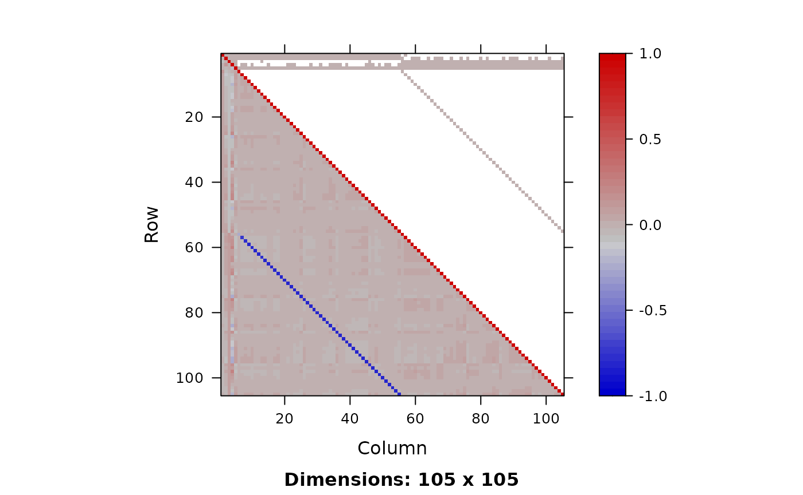

Now I run SNUTS on it and get posterior samples to compare to.

``` r
# some very strong negative correlations so I expect a dense or
# sparse metric to be selected with SNUTS. Because I optimized
# above can skip that
mcmc <- sample_snuts(obj, chains=1, init='random', seed=1234,
                     refresh=0, skip_optimization=TRUE,
                     Q=Q, Qinv=Sigma)
#> Q is 92.58% zeroes, with condition factor=74028 (min=0.014, max=1018.9)
#> Rebuilding RTMB obj without random effects...
#> dense metric selected b/c faster than sparse and high correlation (max=0.81)
#> log-posterior at inits=-2627.037; at conditional mode=-2574.481
#> Starting MCMC sampling...
#> 
#> 
#> Gradient evaluation took 0.000181 seconds
#> 1000 transitions using 10 leapfrog steps per transition would take 1.81 seconds.
#> Adjust your expectations accordingly!
#> 
#> 
#> 
#>  Elapsed Time: 0.352 seconds (Warm-up)
#>                1.651 seconds (Sampling)
#>                2.003 seconds (Total)
#> 
#> 
#> 
#> Model 'RTMB' has 105 pars, and was fit using NUTS with a 'dense' metric
#> 1 chain(s) of 1150 total iterations (150 warmup) were used
#> Average run time per chain was 2 seconds 
#> Minimum ESS=271 (27.1%), and maximum Rhat=1.019
#> There were 0 divergences after warmup
post <- as.data.frame(mcmc)

plot_uncertainties(mcmc)
```


``` r

## get posterior of generated quantities
predWeight <- apply(post,1, \(x) obj$report(x)$predWeight) |> 
  t()
predWeight |> str()
#>  num [1:1000, 1:578] 28.1 29.3 23.5 24.8 26.7 ...

# compare asymptotic vs posterior intervals of first few chicks
par(mfrow=c(2,3))
for(ii in 1:6){
  y <- predWeight[,ii]
  x <- seq(min(y), max(y), len=200)
  y2 <- dnorm(x,est[ii], se[ii])
  hist(y, freq=FALSE, ylim=c(0,max(y2)))
  lines(x, y2, col=2, lwd=2)
}
```

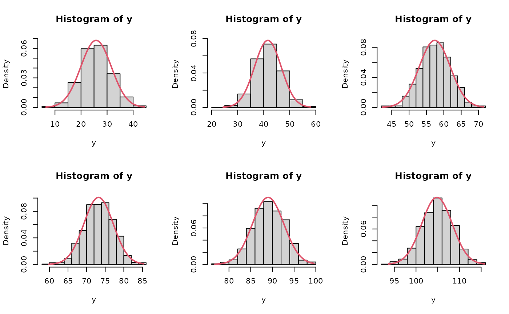

``` r

dev.off()
#> null device 
#>           1
```

## Simulation of parameters and data

Simulation of data can be done directly in R. Specialized simulation
functionality exists for TMB, and to a lesser degree RTMB, but I keep it
simple here for demonstration purposes.

Both data and parameters can be simulated and I explore that below.

### Prior and posterior predictive distributions

``` r
# simulation of data sets can be done manually in R. For instance
# to get posterior predictive I loop through each posterior
# sample and draw new data.
set.seed(351231)
simdat <- apply(post,1, \(x){
   yhat <- obj$report(x)$predWeight
   ysim <- rnorm(n=length(yhat), yhat, sd=exp(x['logsdeps']))
}) |> t()
boxplot(simdat[,1:24], main='Posterior predictive')
points(ChickWeight$weight[1:24], col=2, cex=2, pch=16)
```

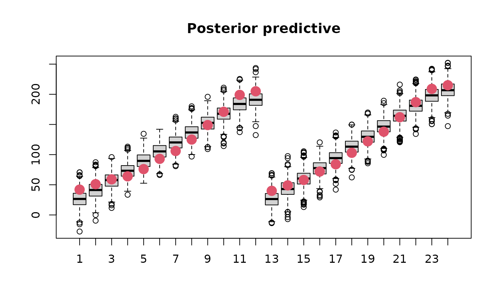

Prior predictive sampling would be done in the same way but is not shown
here.

### Joint precision sampling

Samples can be drawn from $Q$, assuming multivariate normality, as
follows:

``` r
# likewise I can simulate draws from Q to get approximate samples
postQ <- mvtnorm::rmvnorm(1000, mean=mcmc$mle$est, sigma=Sigma)
```

These samples could be put back into the `report` function to get a
distribution of a generated quantity, for instance.

## Model selection with PSIS-LOO

PSIS-LOO is the recommended way to compare predictive performance of
Bayesian models. I use it to compare a simplified Chicks model below
using the `map` argument to turn off estimation of the random intercepts
(‘b’). All this requires is for the vector of log-likelihood values to
be available for each posterior draw. I facilitate this via a
`REPORT(loglik)` call above.

``` r
library(loo)
#> This is loo version 2.8.0
#> - Online documentation and vignettes at mc-stan.org/loo
#> - As of v2.0.0 loo defaults to 1 core but we recommend using as many as possible. Use the 'cores' argument or set options(mc.cores = NUM_CORES) for an entire session.
options(mc.cores=parallel::detectCores())
loglik <- apply(post,1, \(x) obj$report(x)$loglik) |> 
  t()

loo1 <- loo(loglik, cores=4)
#> Warning: Some Pareto k diagnostic values are too high. See help('pareto-k-diagnostic') for details.
print(loo1)
#> 
#> Computed from 1000 by 578 log-likelihood matrix.
#> 
#>          Estimate   SE
#> elpd_loo  -2351.8 19.9
#> p_loo        88.5  6.9
#> looic      4703.6 39.7
#> ------
#> MCSE of elpd_loo is NA.
#> MCSE and ESS estimates assume independent draws (r_eff=1).
#> 
#> Pareto k diagnostic values:
#>                           Count Pct.    Min. ESS
#> (-Inf, 0.67]   (good)     572   99.0%   103     
#>    (0.67, 1]   (bad)        6    1.0%   <NA>    
#>     (1, Inf)   (very bad)   0    0.0%   <NA>    
#> See help('pareto-k-diagnostic') for details.
plot(loo1)
```

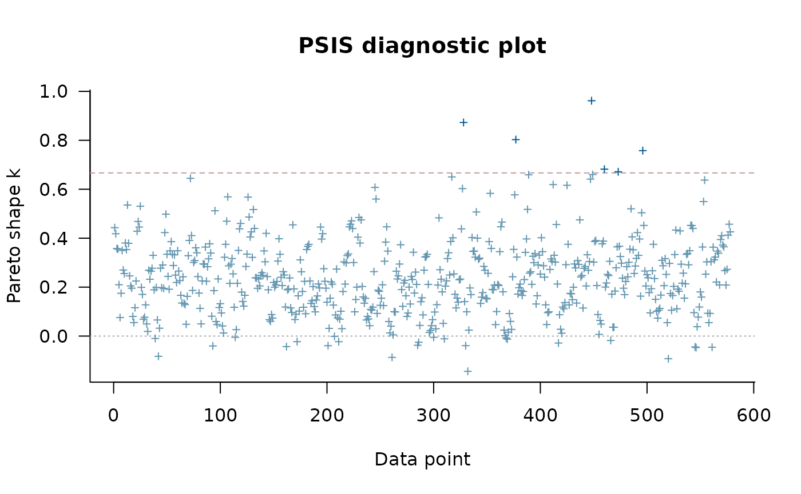

``` r

# I can compare that to a simpler model which doesn't have
# random effects on the slope
obj2 <- MakeADFun(f, parameters, random=c("a"), silent=TRUE,
                  map=list(b=factor(rep(NA, length(parameters$b))), 
                           logsdb=factor(NA),
                           mub=factor(NA)))
mcmc2 <- sample_snuts(obj2, chains=1, seed=1215, refresh=0)
#> Optimizing...
#> Getting Q...
#> Inverting Q...
#> Q is 88.9% zeroes, with condition factor=8423 (min=0.128, max=1080.5)
#> Rebuilding RTMB obj without random effects...
#> diag metric selected b/c of low correlations (max=0.1386)
#> log-posterior at inits=-2745.519; at conditional mode=-2745.519
#> Starting MCMC sampling...
#> 
#> 
#> Gradient evaluation took 0.000105 seconds
#> 1000 transitions using 10 leapfrog steps per transition would take 1.05 seconds.
#> Adjust your expectations accordingly!
#> 
#> 
#> 
#>  Elapsed Time: 0.177 seconds (Warm-up)
#>                0.941 seconds (Sampling)
#>                1.118 seconds (Total)
#> 
#> 
#> 
#> Model 'RTMB' has 53 pars, and was fit using NUTS with a 'diag' metric
#> 1 chain(s) of 1150 total iterations (150 warmup) were used
#> Average run time per chain was 1.12 seconds 
#> Minimum ESS=367 (36.7%), and maximum Rhat=1.01
#> There were 0 divergences after warmup
post2 <- as.data.frame(mcmc2)
loglik2 <- apply(post2,1, \(x) obj2$report(x)$loglik) |> 
  t()
loo2 <- loo(loglik2, cores=4)
#> Warning: Some Pareto k diagnostic values are too high. See help('pareto-k-diagnostic') for details.
print(loo2)
#> 
#> Computed from 1000 by 578 log-likelihood matrix.
#> 
#>          Estimate   SE
#> elpd_loo  -2613.1 14.4
#> p_loo        31.8  3.0
#> looic      5226.2 28.9
#> ------
#> MCSE of elpd_loo is NA.
#> MCSE and ESS estimates assume independent draws (r_eff=1).
#> 
#> Pareto k diagnostic values:
#>                           Count Pct.    Min. ESS
#> (-Inf, 0.67]   (good)     577   99.8%   195     
#>    (0.67, 1]   (bad)        1    0.2%   <NA>    
#>     (1, Inf)   (very bad)   0    0.0%   <NA>    
#> See help('pareto-k-diagnostic') for details.
loo_compare(loo1, loo2)
#>        elpd_diff se_diff
#> model1    0.0       0.0 
#> model2 -261.3      19.3
```

## Advanced features

### Adaptation of Stan diagonal mass matrix

When the estimate of $Q$ does not well approximate the posterior
surface, then it may be advantageous to adapt a diagonal mass matrix to
account for changes in scale. This can be controlled via the
`adapt_stan_metric` argument. This argument is automatically set to
FALSE when using a metric other than ‘stan’ and ‘unit’ since all other
metrics in theory already descale the posterior. This can be overridden
by setting it equal to TRUE

Here I run three versions of the model and compare the NUTS stepsize.
The model version without adaptation uses a shorter warmup period

``` r
library(ggplot2)

adapted1 <- sample_snuts(obj, chains=1, seed=1234, refresh=0,
                        skip_optimization=TRUE, Q=Q, Qinv=Sigma,
                        metric='auto', adapt_stan_metric = TRUE)
#> Q is 92.58% zeroes, with condition factor=74028 (min=0.014, max=1018.9)
#> Rebuilding RTMB obj without random effects...
#> dense metric selected b/c faster than sparse and high correlation (max=0.81)
#> log-posterior at inits=-2574.481; at conditional mode=-2574.481
#> Starting MCMC sampling...
#> 
#> 
#> Gradient evaluation took 0.000187 seconds
#> 1000 transitions using 10 leapfrog steps per transition would take 1.87 seconds.
#> Adjust your expectations accordingly!
#> 
#> 
#> 
#>  Elapsed Time: 2.497 seconds (Warm-up)
#>                2.44 seconds (Sampling)
#>                4.937 seconds (Total)
#> 
#> 
#> 
#> Model 'RTMB' has 105 pars, and was fit using NUTS with a 'dense' metric
#> 1 chain(s) of 2000 total iterations (1000 warmup) were used
#> Average run time per chain was 4.94 seconds 
#> Minimum ESS=282 (28.2%), and maximum Rhat=1.016
#> Warning in cbind(chain = i, iteration = its, x[[i]][ind, , drop = FALSE]):
#> number of rows of result is not a multiple of vector length (arg 1)
#> There were 0 divergences after warmup
adapted2 <- sample_snuts(obj, chains=1, seed=1234, refresh=0,
                     skip_optimization=TRUE, Q=Q, Qinv=Sigma,
                     metric='stan', adapt_stan_metric = TRUE)
#> Rebuilding RTMB obj without random effects...
#> log-posterior at inits=-2574.399
#> Starting MCMC sampling...
#> 
#> 
#> Gradient evaluation took 0.000113 seconds
#> 1000 transitions using 10 leapfrog steps per transition would take 1.13 seconds.
#> Adjust your expectations accordingly!
#> 
#> 
#> 
#>  Elapsed Time: 12.085 seconds (Warm-up)
#>                4.396 seconds (Sampling)
#>                16.481 seconds (Total)
#> 
#> 
#> 
#> Model 'RTMB' has 105 pars, and was fit using NUTS with a 'stan' metric
#> 1 chain(s) of 2000 total iterations (1000 warmup) were used
#> Average run time per chain was 16.48 seconds 
#> Minimum ESS=346 (34.6%), and maximum Rhat=1.016
#> Warning in cbind(chain = i, iteration = its, x[[i]][ind, , drop = FALSE]):
#> number of rows of result is not a multiple of vector length (arg 1)
#> There were 0 divergences after warmup
sp1 <- extract_sampler_params(mcmc, inc_warmup = TRUE) |>
  subset(iteration <= 1050) |> 
  cbind(type='descaled + not adapted')
sp2 <- extract_sampler_params(adapted1, inc_warmup = TRUE) |>
  subset(iteration <= 1050) |> 
  cbind(type='descaled + adapted')
sp3 <- extract_sampler_params(adapted2, inc_warmup = TRUE) |>
  subset(iteration <= 1050) |> 
  cbind(type='adapted')
sp <- rbind(sp1, sp2, sp3)
ggplot(sp, aes(x=iteration, y=stepsize__, color=type)) + geom_line() +
  scale_y_log10() + theme_bw() + theme(legend.position = 'top') +
  labs(color=NULL, x='warmup')
```

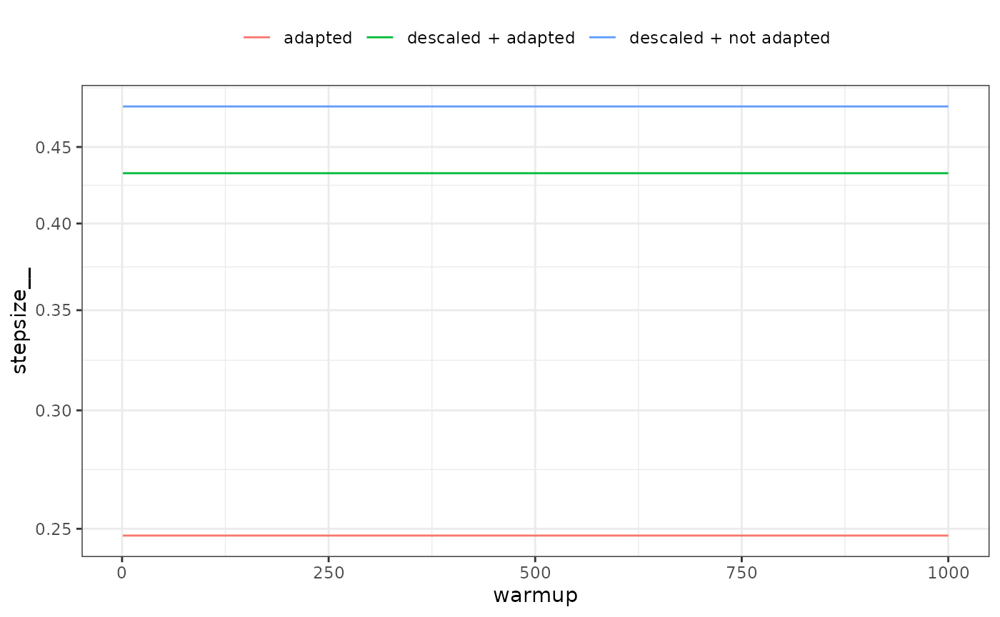

It is apparent that during the first warmup phase the model with Stan
defaults (‘adapted’ in the above plot) has a large adjustment in
stepsize and this corresponds to very long trajectory lengths and thus
increased computational time. If descaled using $Q$ the adaptation does
nothing (‘descaled + adapted’), which is why such a short warmup period
can be used with SNUTS (‘descaled + not adapted’) in this case, and
often which is why the default warmup is short and adaptation disabled
for SNUTS.

In other cases a longer warmup and mass matrix adaptation will make a
difference, see for example the ‘wildf’ model in C. C. Monnahan et al.
(in prep).

### Embedded Laplace approximation SNUTS

This approach uses NUTS (or SNUTS) to sample from the marginal posterior
using the Laplace approximation to integrate the random effects. This
was first explored in (C. C. Monnahan and Kristensen 2018) and later in
more detail in (Margossian et al. 2020) who called it the ‘embedded
Laplace approximation’. (C. C. Monnahan et al. in prep) applied this to
a much larger set of models and found mixed results.

It is trivial to try in SNUTS by simply declaring `laplace=TRUE`.

``` r
ela <- sample_snuts(obj, chains=1, laplace=TRUE, refresh=0)
#> Optimizing...
#> Getting M for fixed effects...
#> Qinv is 0% zeroes, with condition factor=3107 (min=0.001, max=3.3)
#> diag metric selected b/c low correlations (max=0.1458)
#> log-posterior at inits=-2451.942; at conditional mode=-2451.942
#> Starting MCMC sampling...
#> 
#> 
#> Gradient evaluation took 0.000829 seconds
#> 1000 transitions using 10 leapfrog steps per transition would take 8.29 seconds.
#> Adjust your expectations accordingly!
#> 
#> 
#> 
#>  Elapsed Time: 1.235 seconds (Warm-up)
#>                7.187 seconds (Sampling)
#>                8.422 seconds (Total)
#> 
#> 
#> 
#> Model 'RTMB' has 5 pars, and was fit using NUTS with a 'diag' metric
#> 1 chain(s) of 1150 total iterations (150 warmup) were used
#> Average run time per chain was 8.42 seconds 
#> Minimum ESS=572 (57.2%), and maximum Rhat=1.004
#> There were 0 divergences after warmup
```

Here I can see there are only 5 model parameters (the fixed effects),
and that a diagonal metric was chosen due to minimal correlations among
these parameters. ELA will typically take longer to run, but have higher
minESS and so it is best to compare the efficiency (minESS per time)
which I do not do here.

Exploring ELA is a good opportunity to show how SNUTS can fail. I
demonstrate this with the notoriously difficult ‘funnel’ model which is
a hierarchical model without any data. This model has strongly varying
curvature and thus is **not** well-approximated by $Q$ so SNUTS mixes
poorly. But after turning on ELA, it mixes fine and recovers the

``` r
# Funnel example ported to RTMB from
# https://mc-stan.org/docs/cmdstan-guide/diagnose_utility.html#running-the-diagnose-command
## the (negative) posterior density as a function in R
f <- function(pars){
  getAll(pars)
  lp <- dnorm(y, 0, 3, log=TRUE) + # prior
    sum(dnorm(x, 0, exp(y/2), log=TRUE)) # likelihood
  return(-lp) # TMB expects negative log posterior
}
obj <- RTMB::MakeADFun(f, list(y=-1.12, x=rep(0,9)), random='x', silent=TRUE)

### Now SNUTS
fit <- sample_snuts(obj, seed=1213, refresh=0, init='random')
#> Optimizing...
#> Getting Q...
#> Inverting Q...
#> Q is 100% zeroes, with condition factor=9 (min=0.111, max=1)
#> Rebuilding RTMB obj without random effects...
#> diag metric selected b/c of low correlations (max=0)
#> log-posterior at inits=-237.116; at conditional mode=-10.288
#> Starting MCMC sampling...
#> Preparing parallel workspace...
#> Chain 1: Gradient evaluation took 0.000176 seconds
#> Chain 1: 1000 transitions using 10 leapfrog steps per transition would take 1.76 seconds.
#> Chain 1: Adjust your expectations accordingly!
#> Chain 4: Gradient evaluation took 0.000194 seconds
#> Chain 4: 1000 transitions using 10 leapfrog steps per transition would take 1.94 seconds.
#> Chain 4: Adjust your expectations accordingly!
#> Chain 3: Gradient evaluation took 0.00022 seconds
#> Chain 3: 1000 transitions using 10 leapfrog steps per transition would take 2.2 seconds.
#> Chain 3: Adjust your expectations accordingly!
#> Chain 2: Gradient evaluation took 0.000183 seconds
#> Chain 2: 1000 transitions using 10 leapfrog steps per transition would take 1.83 seconds.
#> Chain 2: Adjust your expectations accordingly!
#> Chain 3:  Elapsed Time: 2.295 seconds (Warm-up)
#> Chain 3:                10.243 seconds (Sampling)
#> Chain 3:                12.538 seconds (Total)
#> Chain 2:  Elapsed Time: 3.871 seconds (Warm-up)
#> Chain 2:                13.955 seconds (Sampling)
#> Chain 2:                17.826 seconds (Total)
#> Chain 1:  Elapsed Time: 1.697 seconds (Warm-up)
#> Chain 1:                17.775 seconds (Sampling)
#> Chain 1:                19.472 seconds (Total)
#> Chain 4:  Elapsed Time: 1.421 seconds (Warm-up)
#> Chain 4:                18.427 seconds (Sampling)
#> Chain 4:                19.848 seconds (Total)
#> 8 of 4000 (0.2%) sampling iterations ended with a divergence.
#> These divergent transitions indicate that HMC is not fully able to explore the posterior distribution.
#> Try increasing adapt_delta closer to 1.
#> If this doesn't remove all divergences, try to reparameterize the model.
#> 4 of 4 chains had an E-BFMI below the nominal threshold of 0.3 which suggests that HMC may have trouble exploring the target distribution.
#> If possible, try to reparameterize the model.
#> 
#> 
#> Model 'RTMB' has 10 pars, and was fit using NUTS with a 'diag' metric
#> 4 chain(s) of 1150 total iterations (150 warmup) were used
#> Average run time per chain was 17.42 seconds 
#> Minimum ESS=53 (1.32%), and maximum Rhat=1.094
#> !! Warning: Signs of non-convergence found. Do not use for inference !!
#> There were 8 divergences after warmup
pairs(fit, pars=1:2)
```

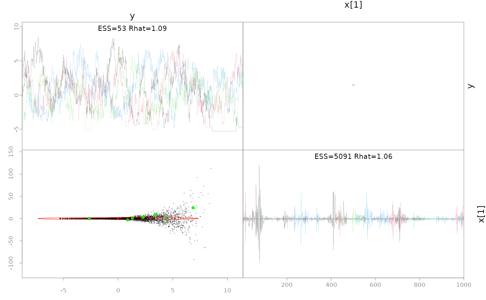

``` r
# hasn't recovered the prior b/c it's not converged, particularly
# for small y values
post <- as.data.frame(fit)
hist(post$y, freq=FALSE, xlim=c(-10,10))
lines(x<-seq(-10,10, len=200), dnorm(x,0,3))
abline(v=fit$mle$est[1], col=2, lwd=2)
```

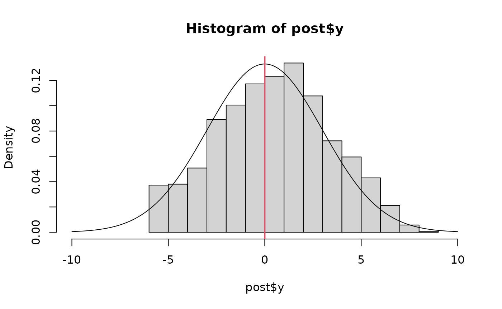

``` r
# Now turn on ELA and it easily recovers the prior on y
fit.ela <- sample_snuts(obj, laplace=TRUE, refresh=0, init='random', seed=12312)
#> Optimizing...
#> Getting M for fixed effects...
#> diag metric selected b/c only 1 parameter
#> log-posterior at inits=-2.681; at conditional mode=-2.018
#> Starting MCMC sampling...
#> Preparing parallel workspace...
#> Chain 1: Gradient evaluation took 0.067631 seconds
#> Chain 1: 1000 transitions using 10 leapfrog steps per transition would take 676.31 seconds.
#> Chain 1: Adjust your expectations accordingly!
#> Chain 4: Gradient evaluation took 0.035142 seconds
#> Chain 4: 1000 transitions using 10 leapfrog steps per transition would take 351.42 seconds.
#> Chain 4: Adjust your expectations accordingly!
#> Chain 2: Gradient evaluation took 0.039829 seconds
#> Chain 2: 1000 transitions using 10 leapfrog steps per transition would take 398.29 seconds.
#> Chain 2: Adjust your expectations accordingly!
#> Chain 3: Gradient evaluation took 0.037843 seconds
#> Chain 3: 1000 transitions using 10 leapfrog steps per transition would take 378.43 seconds.
#> Chain 3: Adjust your expectations accordingly!
#> Chain 1:  Elapsed Time: 0.594 seconds (Warm-up)
#> Chain 1:                3.687 seconds (Sampling)
#> Chain 1:                4.281 seconds (Total)
#> Chain 4:  Elapsed Time: 0.736 seconds (Warm-up)
#> Chain 4:                3.498 seconds (Sampling)
#> Chain 4:                4.234 seconds (Total)
#> Chain 2:  Elapsed Time: 0.652 seconds (Warm-up)
#> Chain 2:                3.704 seconds (Sampling)
#> Chain 2:                4.356 seconds (Total)
#> Chain 3:  Elapsed Time: 0.686 seconds (Warm-up)
#> Chain 3:                3.513 seconds (Sampling)
#> Chain 3:                4.199 seconds (Total)
#> 
#> 
#> Model 'RTMB' has 1 pars, and was fit using NUTS with a 'diag' metric
#> 4 chain(s) of 1150 total iterations (150 warmup) were used
#> Average run time per chain was 4.27 seconds 
#> Minimum ESS=1415 (35.38%), and maximum Rhat=1.005
#> There were 0 divergences after warmup
# you just get the prior back b/c the Laplace approximation is
# accurate
pairs(fit.ela)
```

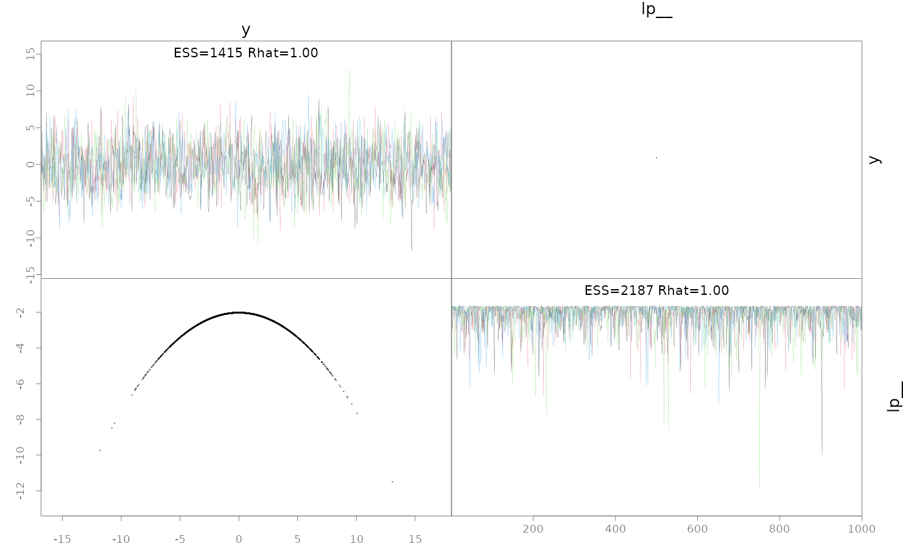

``` r
post.ela <- as.data.frame(fit.ela)
hist(post.ela$y, freq=FALSE, breaks=30)
lines(x<-seq(-10,10, len=200), dnorm(x,0,3))
```

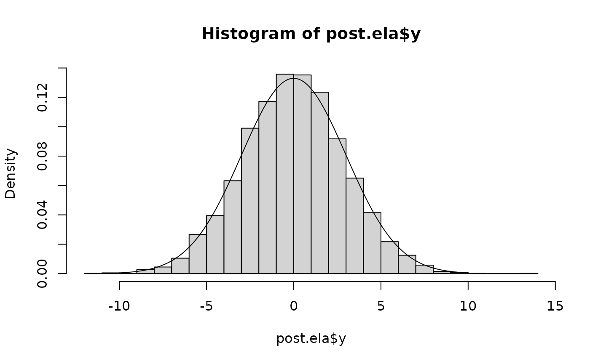

### Linking to other Stan algorithms via StanEstimators

`sample_snuts` links to the
[`StanEstimators::stan_sample`](https://andrjohns.github.io/StanEstimators/reference/stan_sample.html)
function for NUTS sampling. However, this package provides other
algorithms given a model and these may be of interest to some users. I
focus on the Pathfinder algorithm and an RTMB model.

``` r
# Construct a joint model (no random effects)
obj2 <- MakeADFun(func=obj$env$data, parameters=obj$env$parList(), 
                  map=obj$env$map, random=NULL, silent=TRUE)
# TMB does negative log densities so convert to form used by Stan
fn <- function(x) -obj2$fn(x)
grad_fun <- function(x) -obj2$gr(x)
pf <- StanEstimators::stan_pathfinder(fn=fn, grad_fun=grad_fun, refresh=100,
                      par_inits = obj$env$last.par.best)
#> 
#> Path [1] :Initial log joint density = -10.287998
#> Path [1] : Iter      log prob        ||dx||      ||grad||     alpha      alpha0      # evals       ELBO    Best ELBO        Notes 
#>               2       8.084e+01      3.600e+01   4.441e-15    1.000e+00  1.000e+00        62 -4.131e+01 -7.402e+19                  
#> Path [1] :Best Iter: [1] ELBO (-41.305109) evaluations: (62)
#> Path [2] :Initial log joint density = -10.287998
#> Path [2] : Iter      log prob        ||dx||      ||grad||     alpha      alpha0      # evals       ELBO    Best ELBO        Notes 
#>               2       8.084e+01      3.600e+01   4.441e-15    1.000e+00  1.000e+00        62 -4.923e+01 -2.874e+20                  
#> Path [2] :Best Iter: [1] ELBO (-49.230004) evaluations: (62)
#> Path [3] :Initial log joint density = -10.287998
#> Path [3] : Iter      log prob        ||dx||      ||grad||     alpha      alpha0      # evals       ELBO    Best ELBO        Notes 
#>               2       8.084e+01      3.600e+01   4.441e-15    1.000e+00  1.000e+00        62 -4.575e+01 -1.548e+20                  
#> Path [3] :Best Iter: [1] ELBO (-45.753631) evaluations: (62)
#> Path [4] :Initial log joint density = -10.287998
#> Path [4] : Iter      log prob        ||dx||      ||grad||     alpha      alpha0      # evals       ELBO    Best ELBO        Notes 
#>               2       8.084e+01      3.600e+01   4.441e-15    1.000e+00  1.000e+00        62 -3.875e+01 -2.349e+21                  
#> Path [4] :Best Iter: [1] ELBO (-38.747776) evaluations: (62)
#> Pareto k value (1.5) is greater than 0.7. Importance resampling was not able to improve the approximation, which may indicate that the approximation itself is poor.
```

### Linking to other Bayesian tools

It is straightforward to pass `SparseNUTS` output into other Bayesian R
packages. I demonstrate this with `bayesplot`.

``` r
library(bayesplot)
#> This is bayesplot version 1.14.0
#> - Online documentation and vignettes at mc-stan.org/bayesplot
#> - bayesplot theme set to bayesplot::theme_default()
#>    * Does _not_ affect other ggplot2 plots
#>    * See ?bayesplot_theme_set for details on theme setting
library(tidyr)
library(dplyr)
#> 
#> Attaching package: 'dplyr'
#> The following objects are masked from 'package:stats':
#> 
#>     filter, lag
#> The following objects are masked from 'package:base':
#> 
#>     intersect, setdiff, setequal, union
post <- as.data.frame(mcmc)
pars <- mcmc$par_names[1:6]
mcmc_areas(post, pars=pars)
```

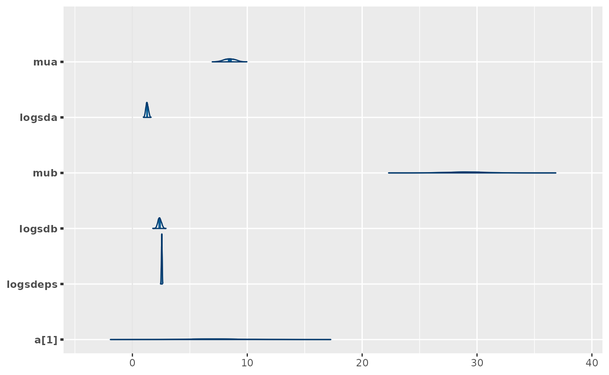

``` r
mcmc_trace(post, pars=pars)
```

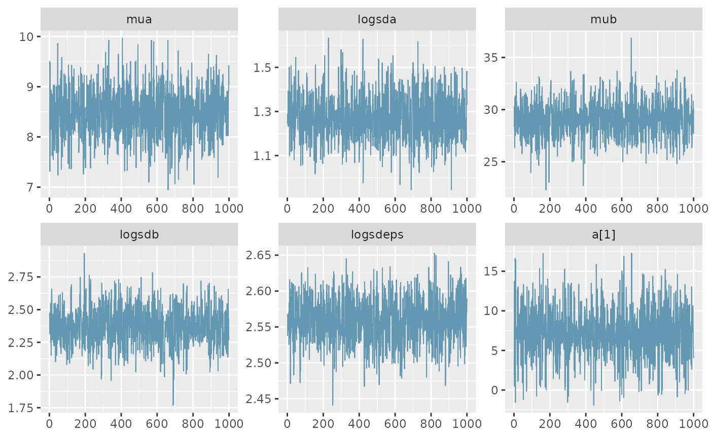

``` r
color_scheme_set("red")
np <- extract_sampler_params(fit) %>%
  pivot_longer(-c(chain, iteration), names_to='Parameter', values_to='Value') %>%
  select(Iteration=iteration, Parameter, Value, Chain=chain) %>%
  mutate(Parameter=factor(Parameter),
         Iteration=as.integer(Iteration),
         Chain=as.integer(Chain)) %>% as.data.frame()
mcmc_nuts_energy(np) + ggtitle("NUTS Energy Diagnostic") + theme_minimal()
#> `stat_bin()` using `bins = 30`. Pick better value `binwidth`.
#> `stat_bin()` using `bins = 30`. Pick better value `binwidth`.
```

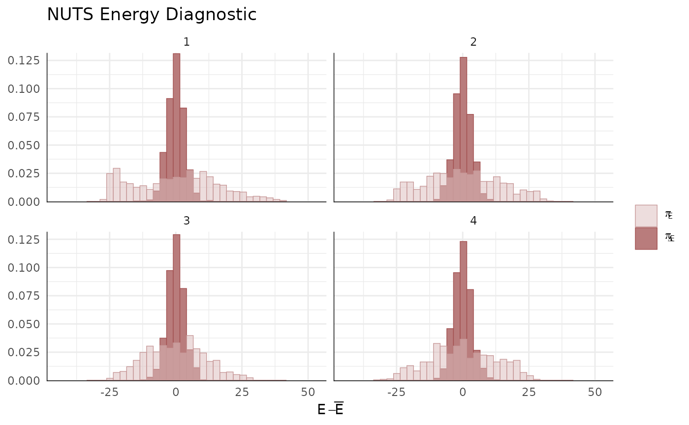

``` r

# finally, posterior predictive for first 24 observations
ppc_intervals(y=ChickWeight$weight[1:24], yrep=simdat[,1:24])
#> Warning: Using `size` aesthetic for lines was deprecated in ggplot2 3.4.0.
#> ℹ Please use `linewidth` instead.
#> ℹ The deprecated feature was likely used in the bayesplot package.
#>   Please report the issue at <https://github.com/stan-dev/bayesplot/issues/>.
#> This warning is displayed once every 8 hours.
#> Call `lifecycle::last_lifecycle_warnings()` to see where this warning was
#> generated.
```


## References

Margossian, Charles, Aki Vehtari, Daniel Simpson, and Raj Agrawal. 2020.
“Hamiltonian Monte Carlo Using an Adjoint-Differentiated Laplace
Approximation: Bayesian Inference for Latent Gaussian Models and
Beyond.” In *Advances in Neural Information Processing Systems*, edited
by H. Larochelle, M. Ranzato, R. Hadsell, M. F. Balcan, and H. Lin,
33:9086–97. Curran Associates, Inc.
<https://proceedings.neurips.cc/paper_files/paper/2020/file/673de96b04fa3adcae1aacda704217ef-Paper.pdf>.

Monnahan, C. C, and Kasper Kristensen. 2018. “No-u-Turn Sampling for
Fast Bayesian Inference in ADMB and TMB: Introducing the Adnuts and
Tmbstan r Packages.” *PloS One* 13 (5).

Monnahan, C. C., Thorson J. T., K. Kristensen, and B. Carpenter. in
prep. “Leveraging Sparsity to Improve No-u-Turn Sampling Efficiency for
Hierarchical Bayesian Models.” *arXiv Preprint*, in prep.
