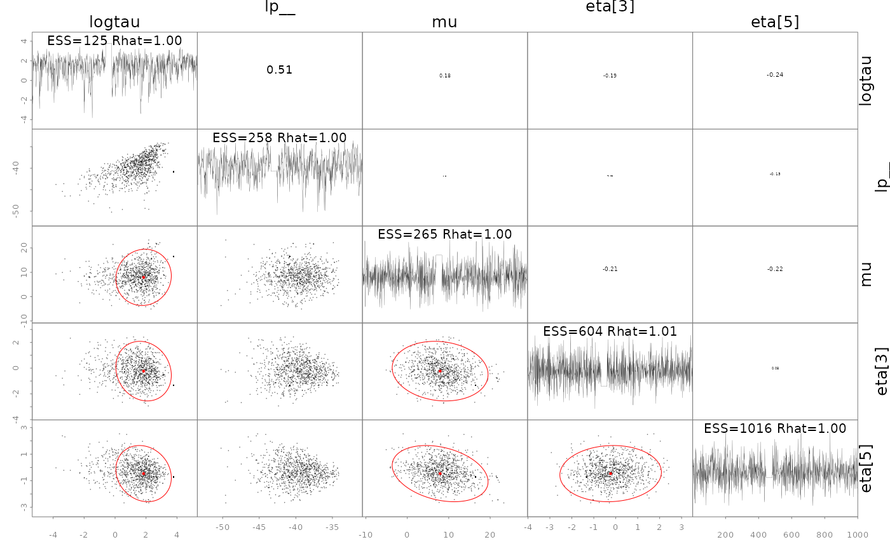
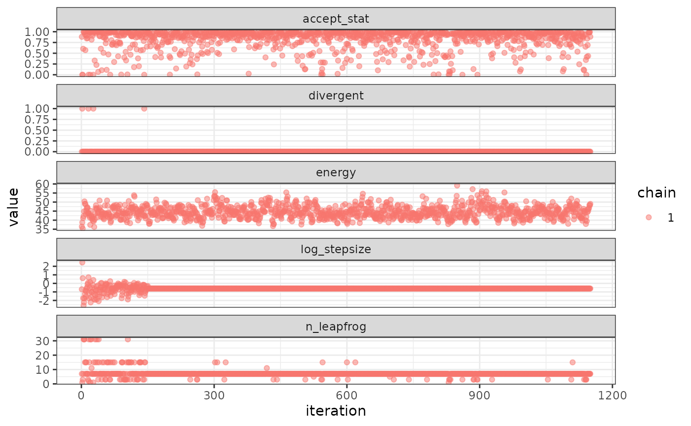
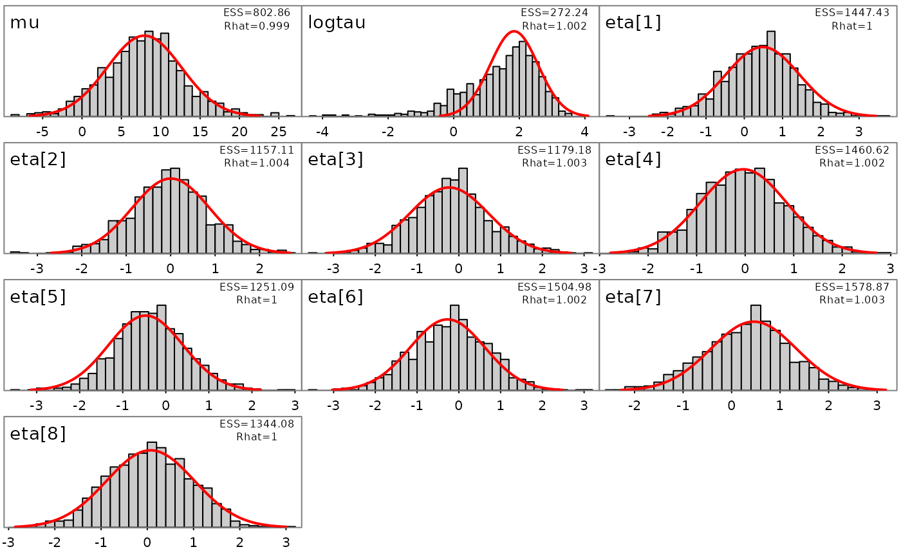

# Introduction to SparseNUTS

The goal of SparseNUTS is to provide a user-friendly workflow for users
of TMB and RTMB who want to implement the sparse no-u-turn sampler (Cole
C. Monnahan et al. 2026) to draw samples from a model.

This package was originally developed inside of the
[adnuts](https://github.com/Cole-Monnahan-NOAA/adnuts) package but was
split off in late 2025 to have a dedicated package for SparseNUTS for
TMB and RTMB models. The `tmbstan` package (C. C. Monnahan and
Kristensen 2018) also provides an interface to the Stan software, but
lacks the ability to decorrelate the target distribution prior to
sampling. `SparseNUTS` provides more flexible options related to the
mass matrix.

## Differences in usage between TMB and RTMB

Both TMB and RTMB models can be used with minimal user intervention,
including running parallel chains. The `sample_snuts` function will
detect which package is used internally and adjust accordingly. If the
user wants to use models from both packages in the same session then one
needs to be unloaded, e.g.,
`if('TMB' %in% .packages()) detach(package:TMB)`, before the other
package is loaded.

If the RTMB model uses external functions or data sets then they must be
passed through via a list in the `globals` argument so they are
available to rebuild the ‘obj’ in the parallel R sessions. Optionally,
the `model_name` can be specified in the call, otherwise your model will
be labeled “RTMB” in the output. TMB models do not require a `globals`
input and the model name is pulled from the DLL name, but can be
overridden if desired.

## Comparison to tmbstan

The related package ‘tmbstan’ (C. C. Monnahan and Kristensen 2018) also
allows users to link TMB models to the Stan algorithms. ‘tmbstan’ links
through the package ‘rstan’, while ‘SparseNUTS’ modifies the objective
and gradient functions and then passes those to ‘cmdstan’ through the
‘StanEstimators’ R package interface. For models without large
correlations or scale differences, `tmbstan` is likely to be faster than
‘SparseNUTS’ due to lower overhead and may be a better option.
Eventually, Stan may add SNUTS functionality and an interface to
‘tmbstan’ developed, and in that case `tmbstan` may be a better long
term option. For TMB users now, SNUTS via `SparseNUTS` is likely to be
the best overall package for Bayesian inference.

## SNUTS for TMB models from existing packages (sdmTMB, glmmTMB, etc.)

`SparseNUTS` works for custom TMB and RTMB models developed locally, but
also for those that come in packages. Most packages will return the TMB
‘obj’ which can then be passed into `sample_snuts`.

For instance the `glmmTMB` package can be run like this:

``` r
library(glmmTMB)
library(SparseNUTS)
data(Salamanders)
obj <- glmmTMB(count~spp * mined + (1|site), Salamanders, family="nbinom2")$obj
fit <- sample_snuts(obj)
```

## Basic usage

The recommended usage for TMB users is to let the `sample_snuts`
function automatically detect the metric to use and the length of warmup
period, especially for pilot runs during model development.

I demonstrate basic usage using a very simple RTMB version of the eight
schools model that has been examined extensively in the Bayesian
literature. The first step is to build the TMB object ‘obj’ that
incorporates priors and Jacobians for parameter transformations. Note
that the R function returns the negative un-normalized log-posterior
density.

``` r
library(RTMB)
library(SparseNUTS)
dat <- list(y=c(28,  8, -3,  7, -1,  1, 18, 12),
            sigma=c(15, 10, 16, 11,  9, 11, 10, 18))
pars <- list(mu=0, logtau=0, eta=rep(1,8))
f <- function(pars){
  getAll(dat, pars)
  theta <- mu + exp(logtau) * eta;
  lp <- sum(dnorm(eta, 0,1, log=TRUE))+ # prior
    sum(dnorm(y,theta,sigma,log=TRUE))+ #likelihood
    logtau                          # jacobian
  REPORT(theta)
  return(-lp)
}
obj <- MakeADFun(func=f, parameters=pars,
                 random="eta", silent=TRUE)
```

### Posterior sampling with SNUTS

The most common task is to draw samples from the posterior density
defined by this model. This is done with the `sample_snuts` function as
follows:

``` r
fit <- sample_snuts(obj, refresh=0, seed=1,
                    model_name = 'schools',
                    cores=1, chains=1,
                    globals=list(dat=dat))
```

    ## Optimizing marginal posterior with 2 fixed effects and 8 random effects...

    ## Getting Q and its stats...

    ## Q is 62.22% sparse | Ratio of marginal SDs=6.5 | Max abs cor >=0.2927

    ## Rebuilding RTMB obj without random effects...

    ## dense metric selected b/c faster than sparse and high correlation (max=0.2927)

    ## log-posterior at inits=(-36.13); at conditional mode=-34.661

    ## Starting MCMC sampling...

    ## 
    ## 
    ## Gradient evaluation took 8.3e-05 seconds
    ## 1000 transitions using 10 leapfrog steps per transition would take 0.83 seconds.
    ## Adjust your expectations accordingly!
    ## 
    ## 
    ## 
    ##  Elapsed Time: 0.088 seconds (Warm-up)
    ##                0.552 seconds (Sampling)
    ##                0.64 seconds (Total)
    ## 
    ## 
    ## 
    ## Model 'schools' has 10 pars and was fit using SNUTS with a 'dense' metric
    ## 1 chain(s) of 1150 total iterations (150 warmup) were used
    ## Run time per chain: average= 0.64 and max= 0.64 seconds 
    ## Min bulk ESS=125.3 (12.53%) [logtau] and maximum Rhat=1.011 [eta[3]]
    ## !! Warning: Signs of non-convergence found. Do not use for inference !!
    ## There were 0 divergences after warmup

The returned object `fit` (an object of ‘adfit’ S3 class) contains the
posterior samples and other relevant information for a Bayesian
analysis.

Here a ‘diag’ (diagonal) metric is selected and a very short warmup
period of 150 iterations is used, with mass matrix adaptation in Stan
disabled. See below for more details on mass matrix adaptation within
Stan.

Notice that no optimization was done before calling `sample_snuts`. When
the model has already been optimized, you can skip that by setting
`skip_optimization=TRUE`, and even pass in $Q$ and $\Sigma = Q^{- 1}$
via arguments `Q` and `Qinv` to bypass this step and save some run time.
This may also be required if the model optimization routine internal to
`sample_snuts` is insufficient. In that case, the user should optimize
prior to SNUTS sampling. The returned fitted object contains a slot
called `mle` (for maximum likelihood estimates) which has the
conditional mode (‘est’), the marginal standard errors ‘se’, a joint
correlation matrix (‘cor’), and the sparse precision matrix $Q$.

``` r
str(fit$mle)
```

    ## List of 6
    ##  $ nopar: int 10
    ##  $ est  : Named num [1:10] 7.92441 1.8414 0.47811 0.00341 -0.2329 ...
    ##   ..- attr(*, "names")= chr [1:10] "mu" "logtau" "eta[1]" "eta[2]" ...
    ##  $ se   : Named num [1:10] 4.725 0.732 0.959 0.872 0.945 ...
    ##   ..- attr(*, "names")= chr [1:10] "mu" "logtau" "eta[1]" "eta[2]" ...
    ##  $ Q    :Formal class 'dsCMatrix' [package "Matrix"] with 7 slots
    ##   .. ..@ i       : int [1:27] 0 1 2 3 4 5 6 7 8 9 ...
    ##   .. ..@ p       : int [1:11] 0 10 19 20 21 22 23 24 25 26 ...
    ##   .. ..@ Dim     : int [1:2] 10 10
    ##   .. ..@ Dimnames:List of 2
    ##   .. .. ..$ : chr [1:10] "mu" "logtau" "eta[1]" "eta[2]" ...
    ##   .. .. ..$ : chr [1:10] "mu" "logtau" "eta[1]" "eta[2]" ...
    ##   .. ..@ x       : num [1:27] 0.0603 -0.0144 0.028 0.0631 0.0246 ...
    ##   .. ..@ uplo    : chr "L"
    ##   .. ..@ factors :List of 2
    ##   .. .. ..$ sPDCholesky:Formal class 'dCHMsimpl' [package "Matrix"] with 11 slots
    ##   .. .. .. .. ..@ x       : num [1:28] 1.1227 0.0173 -0.0552 1.3976 0.0451 ...
    ##   .. .. .. .. ..@ p       : int [1:11] 0 3 6 9 12 15 18 22 25 27 ...
    ##   .. .. .. .. ..@ i       : int [1:28] 0 6 9 1 6 9 2 6 9 3 ...
    ##   .. .. .. .. ..@ nz      : int [1:10] 3 3 3 3 3 3 4 3 2 1
    ##   .. .. .. .. ..@ nxt     : int [1:12] 1 2 3 4 5 6 7 8 9 10 ...
    ##   .. .. .. .. ..@ prv     : int [1:12] 11 0 1 2 3 4 5 6 7 8 ...
    ##   .. .. .. .. ..@ type    : int [1:6] 2 0 0 1 0 0
    ##   .. .. .. .. ..@ colcount: int [1:10] 3 3 3 3 3 3 4 3 2 1
    ##   .. .. .. .. ..@ perm    : int [1:10] 9 8 7 6 5 4 0 2 3 1
    ##   .. .. .. .. ..@ Dim     : int [1:2] 10 10
    ##   .. .. .. .. ..@ Dimnames:List of 2
    ##   .. .. .. .. .. ..$ : chr [1:10] "mu" "logtau" "eta[1]" "eta[2]" ...
    ##   .. .. .. .. .. ..$ : chr [1:10] "mu" "logtau" "eta[1]" "eta[2]" ...
    ##   .. .. ..$ SPdCholesky:Formal class 'dCHMsuper' [package "Matrix"] with 10 slots
    ##   .. .. .. .. ..@ x       : num [1:100] 1.06 0 0 0 0 ...
    ##   .. .. .. .. ..@ super   : int [1:2] 0 10
    ##   .. .. .. .. ..@ pi      : int [1:2] 0 10
    ##   .. .. .. .. ..@ px      : int [1:2] 0 100
    ##   .. .. .. .. ..@ s       : int [1:10] 0 1 2 3 4 5 6 7 8 9
    ##   .. .. .. .. ..@ type    : int [1:6] 2 1 1 1 1 1
    ##   .. .. .. .. ..@ colcount: int [1:10] 3 3 3 3 3 3 4 3 2 1
    ##   .. .. .. .. ..@ perm    : int [1:10] 9 8 7 6 5 4 0 2 3 1
    ##   .. .. .. .. ..@ Dim     : int [1:2] 10 10
    ##   .. .. .. .. ..@ Dimnames:List of 2
    ##   .. .. .. .. .. ..$ : chr [1:10] "mu" "logtau" "eta[1]" "eta[2]" ...
    ##   .. .. .. .. .. ..$ : chr [1:10] "mu" "logtau" "eta[1]" "eta[2]" ...
    ##  $ Qinv : NULL
    ##  $ cor  : num [1:10, 1:10] 1 0.0558 -0.1031 -0.2443 -0.114 ...
    ##   ..- attr(*, "dimnames")=List of 2
    ##   .. ..$ : chr [1:10] "mu" "logtau" "eta[1]" "eta[2]" ...
    ##   .. ..$ : chr [1:10] "mu" "logtau" "eta[1]" "eta[2]" ...

### Diagnostics

The common MCMC diagnostics potential scale reduction (Rhat) and minimum
ESS, as well as the NUTS divergences (see [diagnostics
section](https://mc-stan.org/docs/reference-manual/analysis.html) of the
rstan manual), are printed to console by default or can be accessed in
more depth via the `monitor` slot:

``` r
print(fit)
```

    ## Model 'schools' has 10 pars and was fit using SNUTS with a 'dense' metric
    ## 1 chain(s) of 1150 total iterations (150 warmup) were used
    ## Run time per chain: average= 0.64 and max= 0.64 seconds 
    ## Min bulk ESS=125.3 (12.53%) [logtau] and maximum Rhat=1.011 [eta[3]]
    ## !! Warning: Signs of non-convergence found. Do not use for inference !!
    ## There were 0 divergences after warmup

``` r
fit$monitor |> str()
```

    ## drws_smm [11 × 10] (S3: draws_summary/tbl_df/tbl/data.frame)
    ##  $ variable: chr [1:11] "mu" "logtau" "eta[1]" "eta[2]" ...
    ##  $ mean    : num [1:11] 8.5371 1.4046 0.3463 -0.0702 -0.2308 ...
    ##  $ median  : num [1:11] 8.4999 1.611 0.3322 -0.0822 -0.2602 ...
    ##  $ sd      : num [1:11] 4.831 1.228 0.943 0.864 0.927 ...
    ##  $ mad     : num [1:11] 4.459 1.049 0.927 0.868 0.943 ...
    ##  $ q5      : num [1:11] 0.56 -0.966 -1.199 -1.514 -1.712 ...
    ##  $ q95     : num [1:11] 16.48 3.1 1.95 1.33 1.42 ...
    ##  $ rhat    : num [1:11] 1.001 0.999 1.004 1.001 1.011 ...
    ##  $ ess_bulk: num [1:11] 265 125 1409 1144 604 ...
    ##  $ ess_tail: num [1:11] 597.6 28.9 704.8 522.1 666.6 ...
    ##  - attr(*, "num_args")= list()

A specialized `pairs` plotting function is available (formally called
`pairs_admb`) to examine pair-wise behavior of the posteriors. This can
be useful to help diagnose particularly slow mixing parameters. This
function also displays the conditional mode (point) and 95% bivariate
confidence region (ellipses) as calculated from the approximate
covariance matrix $\Sigma = Q^{- 1}$. The parameters to show can be
specified either vie a character vector like
`pars=c('mu', 'logtau', 'eta[1]')` or an integer vector like `pars=1:3`,
and when using the latter the parameters can be ordered by slowest
mixing (‘slow’), fastest mixing (‘fast’) or by the largest discrepancies
in the approximate marginal variance from $Q$ and the posterior samples
(‘mismatch’). NUTS divergences are shown as green points. See help and
further information at `?pairs.adfit`.

``` r
pairs(fit, order='slow')
```



In some cases it is useful to diagnose the NUTS behavior by examining
the “sampler parameters”, which contain information about the individual
NUTS trajectories.

``` r
extract_sampler_params(fit) |> str()
```

    ## 'data.frame':    1000 obs. of  8 variables:
    ##  $ chain        : num  1 1 1 1 1 1 1 1 1 1 ...
    ##  $ iteration    : num  151 152 153 154 155 156 157 158 159 160 ...
    ##  $ accept_stat__: num  0.8 0.96 0.946 0.813 0.952 ...
    ##  $ stepsize__   : num  0.502 0.502 0.502 0.502 0.502 ...
    ##  $ treedepth__  : num  3 3 3 3 3 2 3 3 3 3 ...
    ##  $ n_leapfrog__ : num  7 15 7 15 7 7 7 7 7 7 ...
    ##  $ divergent__  : num  0 0 0 0 0 0 0 0 0 0 ...
    ##  $ energy__     : num  42.9 45.8 46.5 49.8 48.5 ...

``` r
## or plot them directly
plot_sampler_params(fit)
```



The ShinyStan tool is also available and provides a convenient,
interactive way to check diagnostics via the function
[`launch_shinytmb()`](https://noaa-afsc.github.io/SparseNUTS/reference/launch_shinytmb.md),
but also explore estimates and other important quantities. This is a
valuable tool for a workflow with ‘SparseNUTS’.

### Bayesian inference

After checking for signs of non-convergence the results can be used for
inference. Posterior samples for parameters can be extracted and
examined in R by casting the fitted object to an R data.frame. These
posterior samples can then be put back into the TMB object
`obj$report()` function to extract any desired “generated quantity” in
Stan terminology. Below is a demonstration of how to do this for the
quantity theta (a vector of length 8).

``` r
post <- as.data.frame(fit)
post |> str()
```

    ## 'data.frame':    1000 obs. of  10 variables:
    ##  $ mu    : num  9.87 8.56 9.29 9.57 6.22 ...
    ##  $ logtau: num  1.02 -1.99 -1.85 -1.54 -2.38 ...
    ##  $ eta[1]: num  0.522 0.333 -0.252 -0.474 -0.967 ...
    ##  $ eta[2]: num  0.986 -0.914 0.549 -0.332 -1.27 ...
    ##  $ eta[3]: num  -0.4304 0.0589 -0.0845 -0.4217 -0.591 ...
    ##  $ eta[4]: num  1.741 0.962 -1.633 -1.333 -1.991 ...
    ##  $ eta[5]: num  -0.1247 -0.7945 0.1335 0.0112 0.5583 ...
    ##  $ eta[6]: num  -0.615 0.985 -2.11 -1.649 -0.3 ...
    ##  $ eta[7]: num  0.404 1.194 -1.133 -2.022 -0.834 ...
    ##  $ eta[8]: num  0.552 -1.207 0.906 0.957 0.654 ...

``` r
## now get a generated quantity, here theta which is a vector of
## length 8 so becomes a matrix of posterior samples
theta <- apply(post,1, \(x) obj$report(x)$theta) |> t()
theta |> str()
```

    ##  num [1:1000, 1:8] 11.32 8.6 9.25 9.47 6.13 ...

Likewise, marginal distributions can be explored visually and compared
to the approximate estimate from the conditional mode and $\Sigma$ (red
lines):

``` r
plot_marginals(fit)
```



## References

Monnahan, C. C, and Kasper Kristensen. 2018. “No-u-Turn Sampling for
Fast Bayesian Inference in ADMB and TMB: Introducing the Adnuts and
Tmbstan r Packages.” *PloS One* 13 (5).

Monnahan, Cole C., Kasper Kristensen, James T. Thorson, and Bob
Carpenter. 2026. “Leveraging Sparsity to Improve No-u-Turn Sampling
Efficiency for Hierarchical Bayesian Models.”
<https://arxiv.org/abs/2603.02437>.
