# Advanced usage

``` r
library(SparseNUTS)
```

## A more complicated example

To demonstrate more than the basic usage I will use a more complicated
model. I modified the ChickWeight random slopes and intercepts example
from the RTMB introduction. Modifications include: switching SD
parameters to log space and adding a Jacobian, adding broad priors for
these SDs, and adding a ‘loglik’ vector for PSIS-LOO (below).

``` r
library(RTMB) 
parameters <- list(
  mua=0,          ## Mean slope
  logsda=0,          ## Std of slopes
  mub=0,          ## Mean intercept
  logsdb=0,          ## Std of intercepts
  logsdeps=1,        ## Residual Std
  a=rep(0, 50),   ## Random slope by chick
  b=rep(0, 50)    ## Random intercept by chick
)

f <- function(parms) {
  require(RTMB) # for tmbstan
  getAll(ChickWeight, parms, warn=FALSE)
  sda <- exp(logsda)
  sdb <- exp(logsdb)
  sdeps <- exp(logsdeps)
  ## Optional (enables extra RTMB features)
  weight <- OBS(weight)
  predWeight <- a[Chick] * Time + b[Chick]
  loglik <- dnorm(weight, predWeight, sd=sdeps, log=TRUE)
  
  # calculate the target density
  lp <-   sum(loglik)+ # likelihood
    # random effect vectors
    sum(dnorm(a, mean=mua, sd=sda, log=TRUE)) + 
    sum(dnorm(b, mean=mub, sd=sdb, log=TRUE)) +
    # broad half-normal priors on SD pars
    dnorm(sda, 0, 10, log=TRUE) + 
    dnorm(sdb, 0, 10, log=TRUE) + 
    dnorm(sdeps, 0, 10, log=TRUE) + 
    # jacobian adjustments
    logsda + logsdb + logsdeps
  
  # reporting
  REPORT(loglik)       # for PSIS-LOO
  ADREPORT(predWeight) # delta method
  REPORT(predWeight)   # standard report
  
  return(-lp) # negative log-posterior density
}

obj <- MakeADFun(f, parameters, random=c("a", "b"), silent=TRUE)
```

## Asymptotic (frequentist) approximatation vs full posterior

Instead of sampling from the posterior with MCMC (SNUTS), I can use
asymptotic tools from TMB to get a quick approximation of the
parameters, their covariances, but also uncertainties of generated
quantities via the generalized delta method. See the TMB documentation
for more background. Briefly, the marginal posterior mode is found and a
joint precision matrix $Q$ determined at the conditional mode.
$\Sigma = Q{- 1}$ is the covariance of the parameters.

First I optimize the model and call TMB’s `sdreport` function to get
approximate uncertainties via the delta method and the joint precision
matrix $Q$.

``` r
# optimize
opt <- with(obj, nlminb(par, fn, gr))
# get generalized delta method results and Q
sdrep <- sdreport(obj, getJointPrecision=TRUE)

# get the generalized delta method estimates of asymptotic
# standard errors
est <-as.list(sdrep, 'Estimate', report=TRUE)$predWeight
se <- as.list(sdrep, 'Std. Error', report=TRUE)$predWeight

Q <- sdrep$jointPrecision
# can get the joint covariance and correlation like this
Sigma <- as.matrix(solve(Q))
cor <- cov2cor(Sigma)
plot_Q(Q=Q)
```

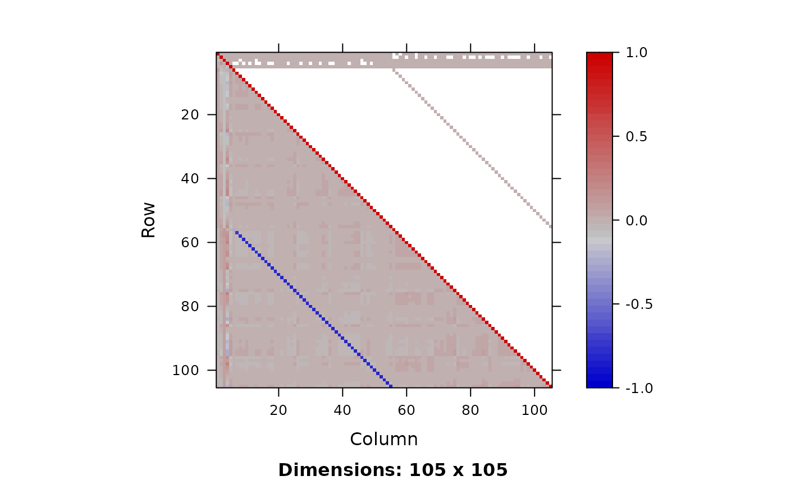

Now I run SNUTS on it and get posterior samples to compare to.

``` r
# some very strong negative correlations so I expect a dense or
# sparse metric to be selected with SNUTS. Because I optimized
# above can skip that
mcmc <- sample_snuts(obj, chains=1, init='random', seed=1234,
                     refresh=0, skip_optimization=TRUE,
                     Q=Q, Qinv=Sigma)
#> Getting Q and its stats...
#> Q is 90.81% sparse | Ratio of marginal SDs=219.3 | Max abs cor >=0.81
#> Rebuilding RTMB obj without random effects...
#> dense metric selected b/c faster than sparse and high correlation (max=0.81)
#> log-posterior at inits=(-2626.56); at conditional mode=-2574.481
#> Starting MCMC sampling...
#> 
#> 
#> Gradient evaluation took 0.00019 seconds
#> 1000 transitions using 10 leapfrog steps per transition would take 1.9 seconds.
#> Adjust your expectations accordingly!
#> 
#> 
#> 
#>  Elapsed Time: 0.376 seconds (Warm-up)
#>                1.904 seconds (Sampling)
#>                2.28 seconds (Total)
#> 
#> 
#> 
#> Model 'RTMB' has 105 pars and was fit using SNUTS with a 'dense' metric
#> 1 chain(s) of 1150 total iterations (150 warmup) were used
#> Run time per chain: average= 2.28 and max= 2.28 seconds 
#> Min bulk ESS=357.2 (35.72%) [lp__] and maximum Rhat=1.015 [a[37]]
#> There were 0 divergences after warmup
post <- as.data.frame(mcmc)

plot_uncertainties(mcmc)
```


``` r

## get posterior of generated quantities
predWeight <- apply(post,1, \(x) obj$report(x)$predWeight) |> 
  t()
predWeight |> str()
#>  num [1:1000, 1:578] 29.9 24.6 27.3 30.8 20.7 ...

# compare asymptotic vs posterior intervals of first few chicks
par(mfrow=c(2,3))
for(ii in 1:6){
  y <- predWeight[,ii]
  x <- seq(min(y), max(y), len=200)
  y2 <- dnorm(x,est[ii], se[ii])
  hist(y, freq=FALSE, ylim=c(0,max(y2)))
  lines(x, y2, col=2, lwd=2)
}
```

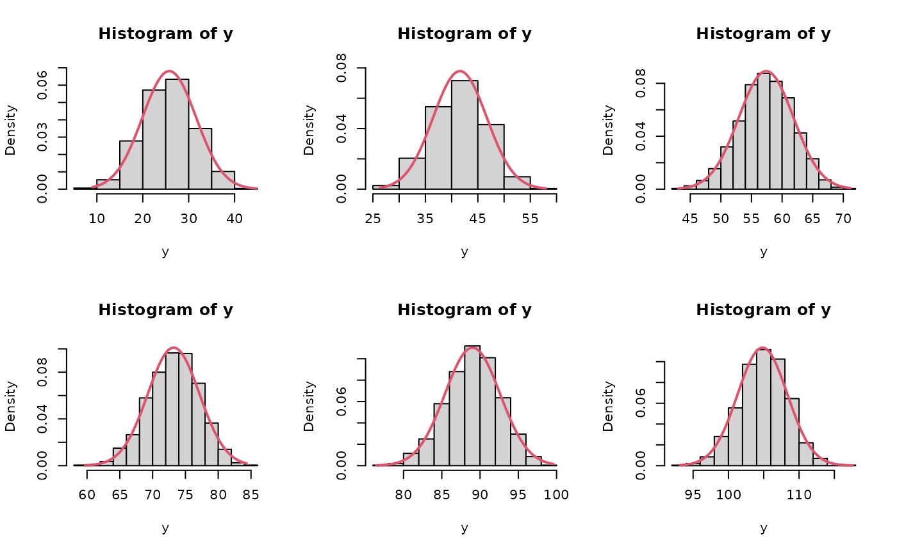

``` r

dev.off()
#> null device 
#>           1
```

## Simulation of parameters and data

Simulation of data can be done directly in R. Specialized simulation
functionality exists for TMB, and to a lesser degree RTMB, but I keep it
simple here for demonstration purposes.

Both data and parameters can be simulated and I explore that below.

### Prior and posterior predictive distributions

``` r
# simulation of data sets can be done manually in R. For instance
# to get posterior predictive I loop through each posterior
# sample and draw new data.
set.seed(351231)
simdat <- apply(post,1, \(x){
   yhat <- obj$report(x)$predWeight
   ysim <- rnorm(n=length(yhat), yhat, sd=exp(x['logsdeps']))
}) |> t()
boxplot(simdat[,1:24], main='Posterior predictive')
points(ChickWeight$weight[1:24], col=2, cex=2, pch=16)
```

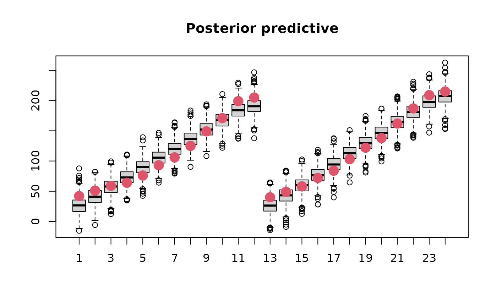

Prior predictive sampling would be done in the same way but is not shown
here.

### Joint precision sampling

Samples can be drawn from $Q$, assuming multivariate normality, as
follows:

``` r
# likewise I can simulate draws from Q to get approximate samples
postQ <- mvtnorm::rmvnorm(1000, mean=mcmc$mle$est, sigma=Sigma)
```

These samples could be put back into the `report` function to get a
distribution of a generated quantity, for instance.

## Model selection with PSIS-LOO

PSIS-LOO is the recommended way to compare predictive performance of
Bayesian models. I use it to compare a simplified Chicks model below
using the `map` argument to turn off estimation of the random intercepts
(‘b’). All this requires is for the vector of log-likelihood values to
be available for each posterior draw. I facilitate this via a
`REPORT(loglik)` call above.

``` r
library(loo)
#> This is loo version 2.9.0
#> - Online documentation and vignettes at mc-stan.org/loo
#> - As of v2.0.0 loo defaults to 1 core but we recommend using as many as possible. Use the 'cores' argument or set options(mc.cores = NUM_CORES) for an entire session.
#library(parallel)
#options(mc.cores=parallel::detectCores()-1)
loglik <- apply(post,1, \(x) obj$report(x)$loglik) |> 
  t()
loo1 <- loo(loglik, cores=1)
#> Warning: Some Pareto k diagnostic values are too high. See help('pareto-k-diagnostic') for details.
print(loo1)
#> 
#> Computed from 1000 by 578 log-likelihood matrix.
#> 
#>          Estimate   SE
#> elpd_loo  -2350.2 19.6
#> p_loo        86.8  6.6
#> looic      4700.4 39.3
#> ------
#> MCSE of elpd_loo is NA.
#> MCSE and ESS estimates assume independent draws (r_eff=1).
#> 
#> Pareto k diagnostic values:
#>                           Count Pct.    Min. ESS
#> (-Inf, 0.67]   (good)     569   98.4%   73      
#>    (0.67, 1]   (bad)        9    1.6%   <NA>    
#>     (1, Inf)   (very bad)   0    0.0%   <NA>    
#> See help('pareto-k-diagnostic') for details.
plot(loo1)
```

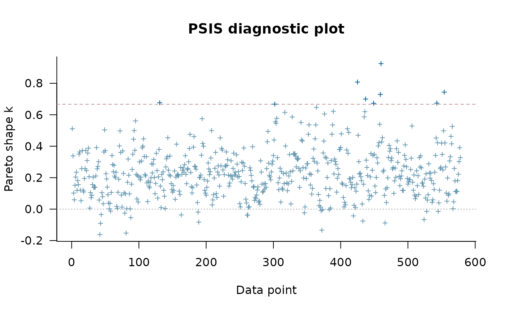

``` r

# I can compare that to a simpler model which doesn't have
# random effects on the slope
obj2 <- MakeADFun(f, parameters, random=c("a"), silent=TRUE,
                  map=list(b=factor(rep(NA, length(parameters$b))), 
                           logsdb=factor(NA),
                           mub=factor(NA)))
mcmc2 <- sample_snuts(obj2, chains=1, seed=1215, refresh=0)
#> Optimizing marginal posterior with 3 fixed effects and 50 random effects...
#> Getting Q and its stats...
#> Q is 88.9% sparse | Ratio of marginal SDs=91.5 | Max abs cor >=0.1386
#> Rebuilding RTMB obj without random effects...
#> diag metric selected b/c low max cor (0.1386)
#> log-posterior at inits=(-2763.6); at conditional mode=-2745.519
#> Starting MCMC sampling...
#> 
#> 
#> Gradient evaluation took 0.000114 seconds
#> 1000 transitions using 10 leapfrog steps per transition would take 1.14 seconds.
#> Adjust your expectations accordingly!
#> 
#> 
#> 
#>  Elapsed Time: 0.167 seconds (Warm-up)
#>                0.909 seconds (Sampling)
#>                1.076 seconds (Total)
#> Warning: The ESS has been capped to avoid unstable estimates.
#> Warning: The ESS has been capped to avoid unstable estimates.
#> 
#> 
#> Model 'RTMB' has 53 pars and was fit using SNUTS with a 'diag' metric
#> 1 chain(s) of 1150 total iterations (150 warmup) were used
#> Run time per chain: average= 1.08 and max= 1.08 seconds 
#> Min bulk ESS=295.4 (29.54%) [lp__] and maximum Rhat=1.013 [a[36]]
#> There were 0 divergences after warmup
post2 <- as.data.frame(mcmc2)
loglik2 <- apply(post2,1, \(x) obj2$report(x)$loglik) |> 
  t()
loo2 <- loo(loglik2, cores=4)
print(loo2)
#> 
#> Computed from 1000 by 578 log-likelihood matrix.
#> 
#>          Estimate   SE
#> elpd_loo  -2613.1 14.5
#> p_loo        32.0  3.1
#> looic      5226.2 29.0
#> ------
#> MCSE of elpd_loo is 0.3.
#> MCSE and ESS estimates assume independent draws (r_eff=1).
#> 
#> All Pareto k estimates are good (k < 0.67).
#> See help('pareto-k-diagnostic') for details.
loo_compare(loo1, loo2)
#>        elpd_diff se_diff
#> model1    0.0       0.0 
#> model2 -262.9      19.0
```

## Advanced features

### Adaptation of Stan diagonal mass matrix

When the estimate of $Q$ does not well approximate the posterior
surface, then it may be advantageous to adapt a diagonal mass matrix to
account for changes in scale. This can be controlled via the
`adapt_stan_metric` argument. This argument is automatically set to
FALSE when using a metric other than ‘stan’ and ‘unit’ since all other
metrics in theory already descale the posterior. This can be overridden
by setting it equal to TRUE

Here I run three versions of the model and compare the NUTS stepsize.
The model version without adaptation uses a shorter warmup period

``` r
library(ggplot2)

adapted1 <- sample_snuts(obj, chains=1, seed=1234, refresh=0,
                        skip_optimization=TRUE, Q=Q, Qinv=Sigma,
                        metric='auto', adapt_stan_metric = TRUE)
#> Getting Q and its stats...
#> Q is 90.81% sparse | Ratio of marginal SDs=219.3 | Max abs cor >=0.81
#> Rebuilding RTMB obj without random effects...
#> dense metric selected b/c faster than sparse and high correlation (max=0.81)
#> log-posterior at inits=(-2660.26); at conditional mode=-2574.481
#> Starting MCMC sampling...
#> 
#> 
#> Gradient evaluation took 0.000182 seconds
#> 1000 transitions using 10 leapfrog steps per transition would take 1.82 seconds.
#> Adjust your expectations accordingly!
#> 
#> 
#> 
#>  Elapsed Time: 2.454 seconds (Warm-up)
#>                3.117 seconds (Sampling)
#>                5.571 seconds (Total)
#> 
#> 
#> 
#> Model 'RTMB' has 105 pars and was fit using SNUTS with a 'dense' metric
#> 1 chain(s) of 2000 total iterations (1000 warmup) were used
#> Run time per chain: average= 5.57 and max= 5.57 seconds 
#> Min bulk ESS=278.9 (27.89%) [lp__] and maximum Rhat=1.016 [a[44]]
#> There were 0 divergences after warmup
adapted2 <- sample_snuts(obj, chains=1, seed=1234, refresh=0,
                     skip_optimization=TRUE, Q=Q, Qinv=Sigma,
                     metric='stan', adapt_stan_metric = TRUE)
#> Rebuilding RTMB obj without random effects...
#> log-posterior at inits=(-2574.4)
#> Starting MCMC sampling...
#> 
#> 
#> Gradient evaluation took 0.000109 seconds
#> 1000 transitions using 10 leapfrog steps per transition would take 1.09 seconds.
#> Adjust your expectations accordingly!
#> 
#> 
#> 
#>  Elapsed Time: 12.716 seconds (Warm-up)
#>                4.623 seconds (Sampling)
#>                17.339 seconds (Total)
#> 
#> 
#> 
#> Model 'RTMB' has 105 pars and was fit using SNUTS with a 'stan' metric
#> 1 chain(s) of 2000 total iterations (1000 warmup) were used
#> Run time per chain: average= 17.34 and max= 17.34 seconds 
#> Min bulk ESS=368.7 (36.87%) [lp__] and maximum Rhat=1.023 [b[44]]
#> There were 0 divergences after warmup
sp1 <- extract_sampler_params(mcmc, inc_warmup = TRUE) |>
  subset(iteration <= 1050) |> 
  cbind(type='descaled + not adapted')
sp2 <- extract_sampler_params(adapted1, inc_warmup = TRUE) |>
  subset(iteration <= 1050) |> 
  cbind(type='descaled + adapted')
sp3 <- extract_sampler_params(adapted2, inc_warmup = TRUE) |>
  subset(iteration <= 1050) |> 
  cbind(type='adapted')
sp <- rbind(sp1, sp2, sp3)
ggplot(sp, aes(x=iteration, y=stepsize__, color=type)) + geom_line() +
  scale_y_log10() + theme_bw() + theme(legend.position = 'top') +
  labs(color=NULL, x='warmup')
```

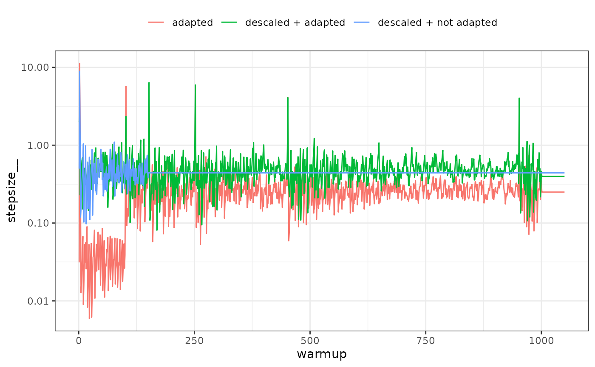

It is apparent that during the first warmup phase the model with Stan
defaults (‘adapted’ in the above plot) has a large adjustment in
stepsize and this corresponds to very long trajectory lengths and thus
increased computational time. If descaled using $Q$ the adaptation does
nothing (‘descaled + adapted’), which is why such a short warmup period
can be used with SNUTS (‘descaled + not adapted’) in this case, and
often which is why the default warmup is short and adaptation disabled
for SNUTS.

In other cases a longer warmup and mass matrix adaptation will make a
difference, see for example the ‘wildf’ model in Cole C. Monnahan et al.
(2026).

### Embedded Laplace approximation SNUTS

This approach uses NUTS (or SNUTS) to sample from the marginal posterior
using the Laplace approximation to integrate the random effects. This
was first explored in (C. C. Monnahan and Kristensen 2018) and later in
more detail in (Margossian et al. 2020) who called it the ‘embedded
Laplace approximation’. (Cole C. Monnahan et al. 2026) applied this to a
much larger set of models and found mixed results.

It is trivial to try in SNUTS by simply declaring `laplace=TRUE`.

``` r
ela <- sample_snuts(obj, chains=1, laplace=TRUE, refresh=0)
#> Optimizing marginal posterior with 5 fixed effects and 100 random effects...
#> Getting Qinv and stats for fixed effects...
#> Qinv is 0% sparse | Ratio of marginal SDs=55 | Max abs cor >=0.1458
#> diag metric selected b/c low max cor (0.1458)
#> log-posterior at inits=(-2456.34); at conditional mode=-2451.942
#> Starting MCMC sampling...
#> 
#> 
#> Gradient evaluation took 0.001225 seconds
#> 1000 transitions using 10 leapfrog steps per transition would take 12.25 seconds.
#> Adjust your expectations accordingly!
#> 
#> 
#> 
#>  Elapsed Time: 1.195 seconds (Warm-up)
#>                6.843 seconds (Sampling)
#>                8.038 seconds (Total)
#> 
#> 
#> 
#> Model 'RTMB' has 5 pars and was fit using SNUTS with a 'diag' metric
#> 1 chain(s) of 1150 total iterations (150 warmup) were used
#> Run time per chain: average= 8.04 and max= 8.04 seconds 
#> Min bulk ESS=526.6 (52.66%) [lp__] and maximum Rhat=1.007 [lp__]
#> There were 0 divergences after warmup
```

Here I can see there are only 5 model parameters (the fixed effects),
and that a diagonal metric was chosen due to minimal correlations among
these parameters. ELA will typically take longer to run, but have higher
minESS and so it is best to compare the efficiency (minESS per time)
which I do not do here.

Exploring ELA is a good opportunity to show how SNUTS can fail. I
demonstrate this with the notoriously difficult ‘funnel’ model which is
a hierarchical model without any data. This model has strongly varying
curvature and thus is **not** well-approximated by $Q$ so SNUTS mixes
poorly. But after turning on ELA, it mixes fine and recovers the

``` r
# Funnel example ported to RTMB from
# https://mc-stan.org/docs/cmdstan-guide/diagnose_utility.html#running-the-diagnose-command
## the (negative) posterior density as a function in R
f <- function(pars){
  getAll(pars)
  lp <- dnorm(y, 0, 3, log=TRUE) + # prior
    sum(dnorm(x, 0, exp(y/2), log=TRUE)) # likelihood
  return(-lp) # TMB expects negative log posterior
}
obj <- RTMB::MakeADFun(f, list(y=-1.12, x=rep(0,9)), random='x', silent=TRUE)

### Now SNUTS
fit <- sample_snuts(obj, seed=1213, refresh=0, init='random')
#> Optimizing marginal posterior with 1 fixed effects and 9 random effects...
#> Getting Q and its stats...
#> Warning in max(abs(cors)): no non-missing arguments to max; returning -Inf
#> Q is 100% sparse | Ratio of marginal SDs=3 | Max abs cor >=-Inf
#> Rebuilding RTMB obj without random effects...
#> diag metric selected b/c low max cor (0)
#> log-posterior at inits=(-237.12,-23.12,-37.52,-20.55); at conditional mode=-10.288
#> Starting MCMC sampling...
#> Preparing parallel workspace...
#> Chain 4: Gradient evaluation took 0.000183 seconds
#> Chain 4: 1000 transitions using 10 leapfrog steps per transition would take 1.83 seconds.
#> Chain 4: Adjust your expectations accordingly!
#> Chain 1: Gradient evaluation took 0.000182 seconds
#> Chain 1: 1000 transitions using 10 leapfrog steps per transition would take 1.82 seconds.
#> Chain 1: Adjust your expectations accordingly!
#> Chain 3: Gradient evaluation took 0.000185 seconds
#> Chain 3: 1000 transitions using 10 leapfrog steps per transition would take 1.85 seconds.
#> Chain 3: Adjust your expectations accordingly!
#> Chain 2: Gradient evaluation took 0.000202 seconds
#> Chain 2: 1000 transitions using 10 leapfrog steps per transition would take 2.02 seconds.
#> Chain 2: Adjust your expectations accordingly!
#> Chain 1:  Elapsed Time: 2.543 seconds (Warm-up)
#> Chain 1:                5.076 seconds (Sampling)
#> Chain 1:                7.619 seconds (Total)
#> Chain 4:  Elapsed Time: 0.812 seconds (Warm-up)
#> Chain 4:                9.256 seconds (Sampling)
#> Chain 4:                10.068 seconds (Total)
#> Chain 3:  Elapsed Time: 3.275 seconds (Warm-up)
#> Chain 3:                8.801 seconds (Sampling)
#> Chain 3:                12.076 seconds (Total)
#> Chain 2:  Elapsed Time: 5.36 seconds (Warm-up)
#> Chain 2:                11.294 seconds (Sampling)
#> Chain 2:                16.654 seconds (Total)
#> 
#> 
#> Model 'RTMB' has 10 pars and was fit using SNUTS with a 'diag' metric
#> 4 chain(s) of 1150 total iterations (150 warmup) were used
#> Run time per chain: average= 11.6 and max= 16.65 seconds 
#> Min bulk ESS=89.5 (2.24%) [lp__] and maximum Rhat=1.036 [y]
#> !! Warning: Signs of non-convergence found. Do not use for inference !!
#> There were 0 divergences after warmup
pairs(fit, pars=1:2)
```

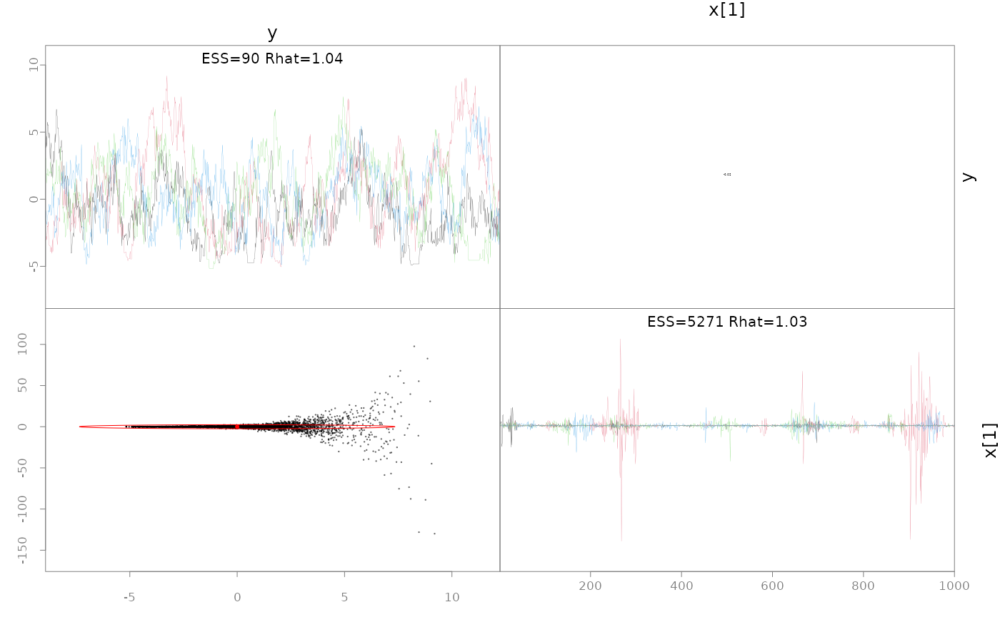

``` r
# hasn't recovered the prior b/c it's not converged, particularly
# for small y values
post <- as.data.frame(fit)
hist(post$y, freq=FALSE, xlim=c(-10,10))
lines(x<-seq(-10,10, len=200), dnorm(x,0,3))
abline(v=fit$mle$est[1], col=2, lwd=2)
```

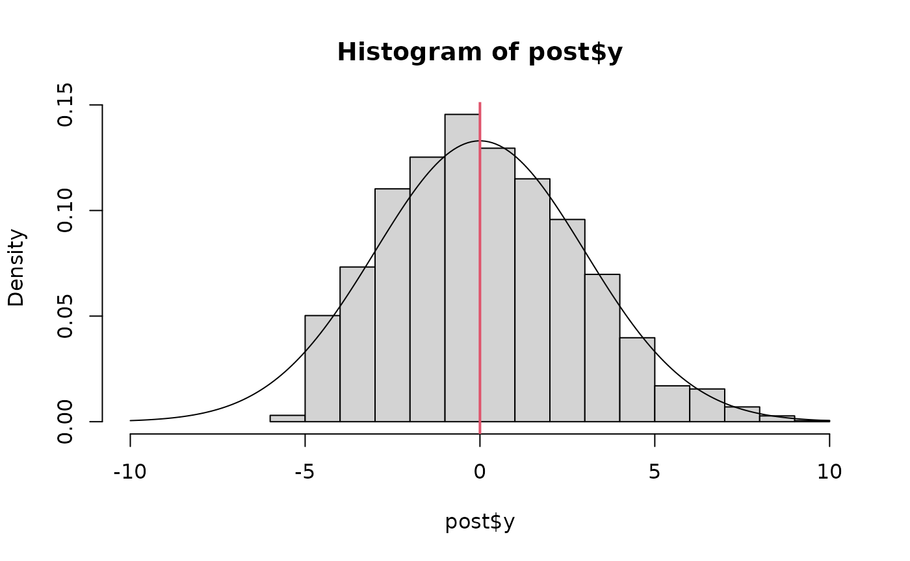

``` r
# Now turn on ELA and it easily recovers the prior on y
fit.ela <- sample_snuts(obj, laplace=TRUE, refresh=0, init='random', seed=12312)
#> Optimizing marginal posterior with 1 fixed effects and 9 random effects...
#> Getting Qinv and stats for fixed effects...
#> diag metric selected b/c only 1 parameter
#> log-posterior at inits=(-2.68,-2.25,-2.1,-2.08); at conditional mode=-2.018
#> Starting MCMC sampling...
#> Preparing parallel workspace...
#> Chain 1: Gradient evaluation took 0.029151 seconds
#> Chain 1: 1000 transitions using 10 leapfrog steps per transition would take 291.51 seconds.
#> Chain 1: Adjust your expectations accordingly!
#> Chain 3: Gradient evaluation took 0.029662 seconds
#> Chain 3: 1000 transitions using 10 leapfrog steps per transition would take 296.62 seconds.
#> Chain 3: Adjust your expectations accordingly!
#> Chain 4: Gradient evaluation took 0.031739 seconds
#> Chain 4: 1000 transitions using 10 leapfrog steps per transition would take 317.39 seconds.
#> Chain 4: Adjust your expectations accordingly!
#> Chain 2: Gradient evaluation took 0.060097 seconds
#> Chain 2: 1000 transitions using 10 leapfrog steps per transition would take 600.97 seconds.
#> Chain 2: Adjust your expectations accordingly!
#> Chain 1:  Elapsed Time: 0.628 seconds (Warm-up)
#> Chain 1:                3.092 seconds (Sampling)
#> Chain 1:                3.72 seconds (Total)
#> Chain 3:  Elapsed Time: 0.405 seconds (Warm-up)
#> Chain 3:                3.609 seconds (Sampling)
#> Chain 3:                4.014 seconds (Total)
#> Chain 4:  Elapsed Time: 0.6 seconds (Warm-up)
#> Chain 4:                3.038 seconds (Sampling)
#> Chain 4:                3.638 seconds (Total)
#> Chain 2:  Elapsed Time: 0.784 seconds (Warm-up)
#> Chain 2:                2.192 seconds (Sampling)
#> Chain 2:                2.976 seconds (Total)
#> 
#> 
#> Model 'RTMB' has 1 pars and was fit using SNUTS with a 'diag' metric
#> 4 chain(s) of 1150 total iterations (150 warmup) were used
#> Run time per chain: average= 3.59 and max= 4.01 seconds 
#> Min bulk ESS=1705.7 (42.64%) [y] and maximum Rhat=1.001 [lp__]
#> There were 0 divergences after warmup
# you just get the prior back b/c the Laplace approximation is
# accurate
pairs(fit.ela)
```


``` r
post.ela <- as.data.frame(fit.ela)
hist(post.ela$y, freq=FALSE, breaks=30)
lines(x<-seq(-10,10, len=200), dnorm(x,0,3))
```


### Linking to other Stan algorithms via StanEstimators

`sample_snuts` links to the
[`StanEstimators::stan_sample`](https://andrjohns.github.io/StanEstimators/reference/stan_sample.html)
function for NUTS sampling. However, this package provides other
algorithms given a model and these may be of interest to some users. I
focus on the Pathfinder algorithm and an RTMB model.

``` r
# Construct a joint model (no random effects)
obj2 <- MakeADFun(func=obj$env$data, parameters=obj$env$parList(), 
                  map=obj$env$map, random=NULL, silent=TRUE)
# TMB does negative log densities so convert to form used by Stan
fn <- function(x) -obj2$fn(x)
grad_fun <- function(x) -obj2$gr(x)
pf <- StanEstimators::stan_pathfinder(fn=fn, grad_fun=grad_fun, refresh=100,
                      par_inits = obj$env$last.par.best)
#> 
#> Path [1] :Initial log joint density = -10.287998
#> Path [1] : Iter      log prob        ||dx||      ||grad||     alpha      alpha0      # evals       ELBO    Best ELBO        Notes 
#>               2       8.084e+01      3.600e+01   1.776e-15    1.000e+00  1.000e+00        62 -5.380e+01 -4.349e+20                  
#> Path [1] :Best Iter: [1] ELBO (-53.803757) evaluations: (62)
#> Path [2] :Initial log joint density = -10.287998
#> Path [2] : Iter      log prob        ||dx||      ||grad||     alpha      alpha0      # evals       ELBO    Best ELBO        Notes 
#>               2       8.084e+01      3.600e+01   1.776e-15    1.000e+00  1.000e+00        62 -4.185e+01 -2.471e+20                  
#> Path [2] :Best Iter: [1] ELBO (-41.853255) evaluations: (62)
#> Path [3] :Initial log joint density = -10.287998
#> Path [3] : Iter      log prob        ||dx||      ||grad||     alpha      alpha0      # evals       ELBO    Best ELBO        Notes 
#>               2       8.084e+01      3.600e+01   1.776e-15    1.000e+00  1.000e+00        62 -3.286e+01 -8.686e+19                  
#> Path [3] :Best Iter: [1] ELBO (-32.857679) evaluations: (62)
#> Path [4] :Initial log joint density = -10.287998
#> Path [4] : Iter      log prob        ||dx||      ||grad||     alpha      alpha0      # evals       ELBO    Best ELBO        Notes 
#>               2       8.084e+01      3.600e+01   1.776e-15    1.000e+00  1.000e+00        62 -3.768e+01 -2.294e+20                  
#> Path [4] :Best Iter: [1] ELBO (-37.681294) evaluations: (62)
#> Pareto k value (1.8) is greater than 0.7. Importance resampling was not able to improve the approximation, which may indicate that the approximation itself is poor.
```

### Linking to other Bayesian tools

It is straightforward to pass `SparseNUTS` output into other Bayesian R
packages. I demonstrate this with `bayesplot`.

``` r
library(bayesplot)
#> This is bayesplot version 1.15.0
#> - Online documentation and vignettes at mc-stan.org/bayesplot
#> - bayesplot theme set to bayesplot::theme_default()
#>    * Does _not_ affect other ggplot2 plots
#>    * See ?bayesplot_theme_set for details on theme setting
library(tidyr)
library(dplyr)
#> 
#> Attaching package: 'dplyr'
#> The following objects are masked from 'package:stats':
#> 
#>     filter, lag
#> The following objects are masked from 'package:base':
#> 
#>     intersect, setdiff, setequal, union
post <- as.data.frame(mcmc)
pars <- mcmc$par_names[1:6]
mcmc_areas(post, pars=pars)
```

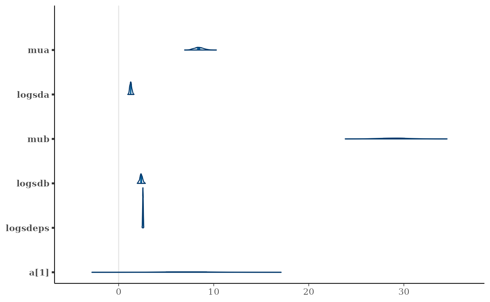

``` r
mcmc_trace(post, pars=pars)
```

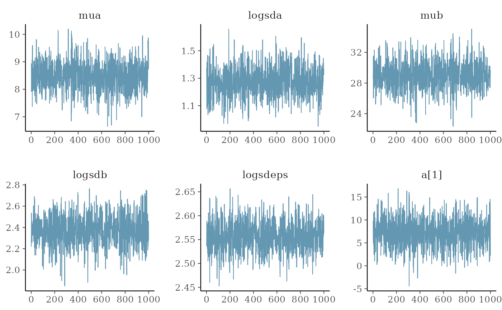

``` r
color_scheme_set("red")
np <- extract_sampler_params(fit) %>%
  pivot_longer(-c(chain, iteration), names_to='Parameter', values_to='Value') %>%
  select(Iteration=iteration, Parameter, Value, Chain=chain) %>%
  mutate(Parameter=factor(Parameter),
         Iteration=as.integer(Iteration),
         Chain=as.integer(Chain)) %>% as.data.frame()
mcmc_nuts_energy(np) + ggtitle("NUTS Energy Diagnostic") + theme_minimal()
#> `stat_bin()` using `bins = 30`. Pick better value `binwidth`.
#> `stat_bin()` using `bins = 30`. Pick better value `binwidth`.
```

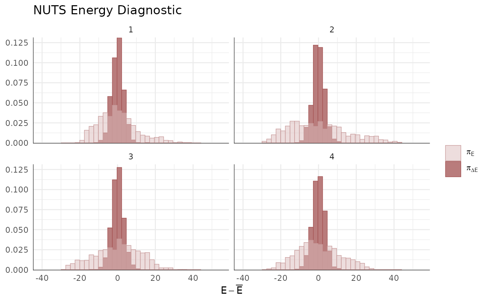

``` r

# finally, posterior predictive for first 24 observations
ppc_intervals(y=ChickWeight$weight[1:24], yrep=simdat[,1:24])
#> Warning: Using `size` aesthetic for lines was deprecated in ggplot2 3.4.0.
#> ℹ Please use `linewidth` instead.
#> ℹ The deprecated feature was likely used in the bayesplot package.
#>   Please report the issue at <https://github.com/stan-dev/bayesplot/issues/>.
#> This warning is displayed once per session.
#> Call `lifecycle::last_lifecycle_warnings()` to see where this warning was
#> generated.
```

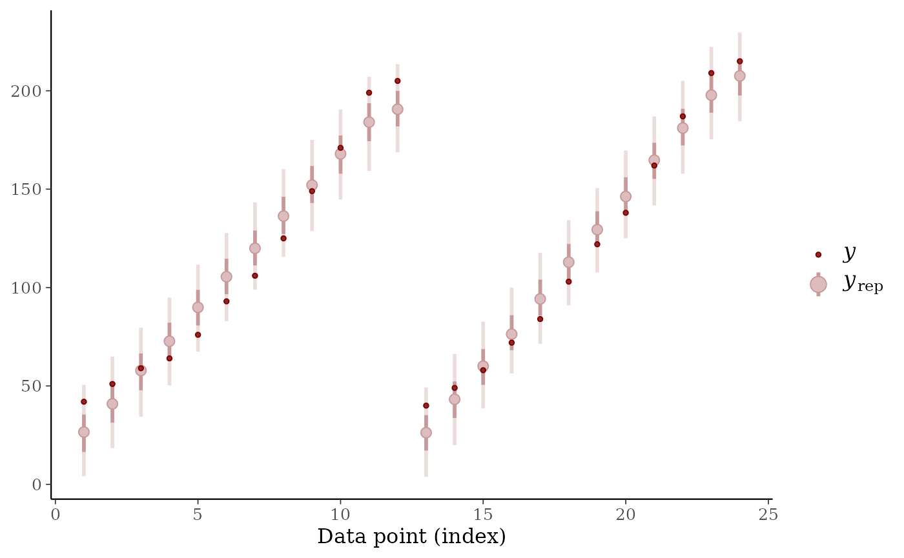

## References

Margossian, Charles, Aki Vehtari, Daniel Simpson, and Raj Agrawal. 2020.
“Hamiltonian Monte Carlo Using an Adjoint-Differentiated Laplace
Approximation: Bayesian Inference for Latent Gaussian Models and
Beyond.” In *Advances in Neural Information Processing Systems*, edited
by H. Larochelle, M. Ranzato, R. Hadsell, M. F. Balcan, and H. Lin,
33:9086–97. Curran Associates, Inc.
<https://proceedings.neurips.cc/paper_files/paper/2020/file/673de96b04fa3adcae1aacda704217ef-Paper.pdf>.

Monnahan, C. C, and Kasper Kristensen. 2018. “No-u-Turn Sampling for
Fast Bayesian Inference in ADMB and TMB: Introducing the Adnuts and
Tmbstan r Packages.” *PloS One* 13 (5).

Monnahan, Cole C., Kasper Kristensen, James T. Thorson, and Bob
Carpenter. 2026. “Leveraging Sparsity to Improve No-u-Turn Sampling
Efficiency for Hierarchical Bayesian Models.”
<https://arxiv.org/abs/2603.02437>.
